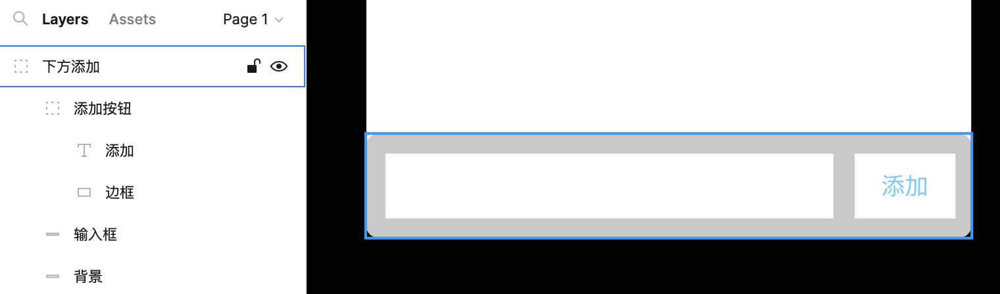
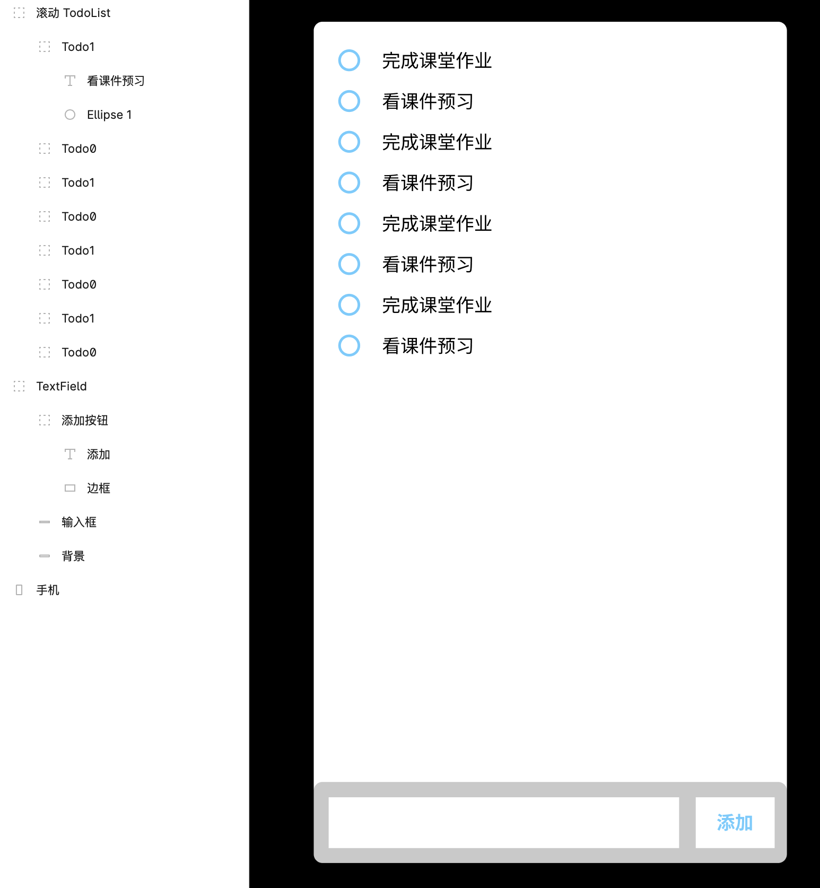
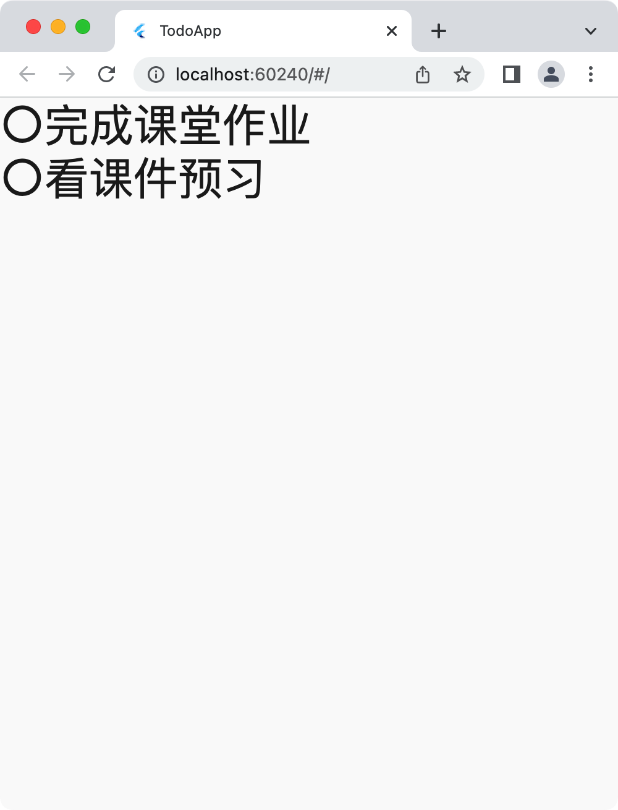
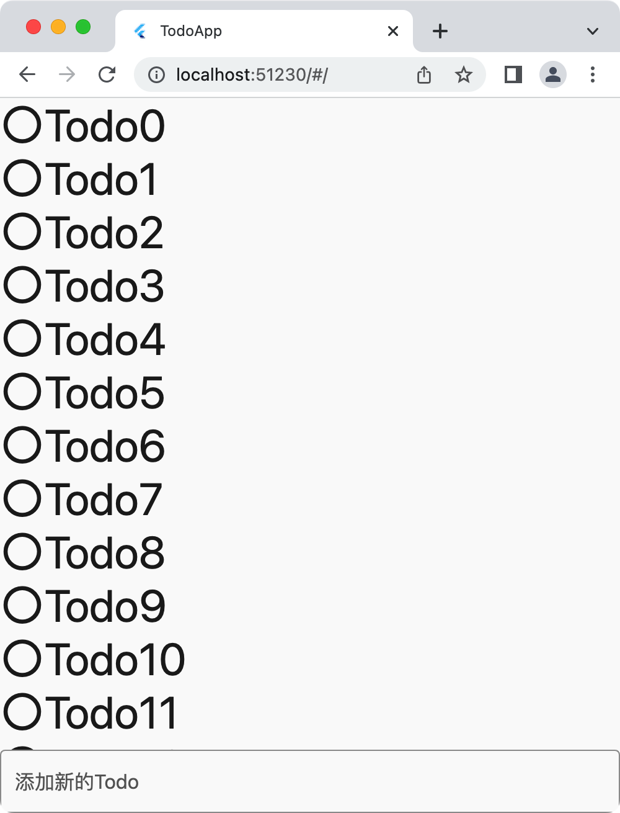
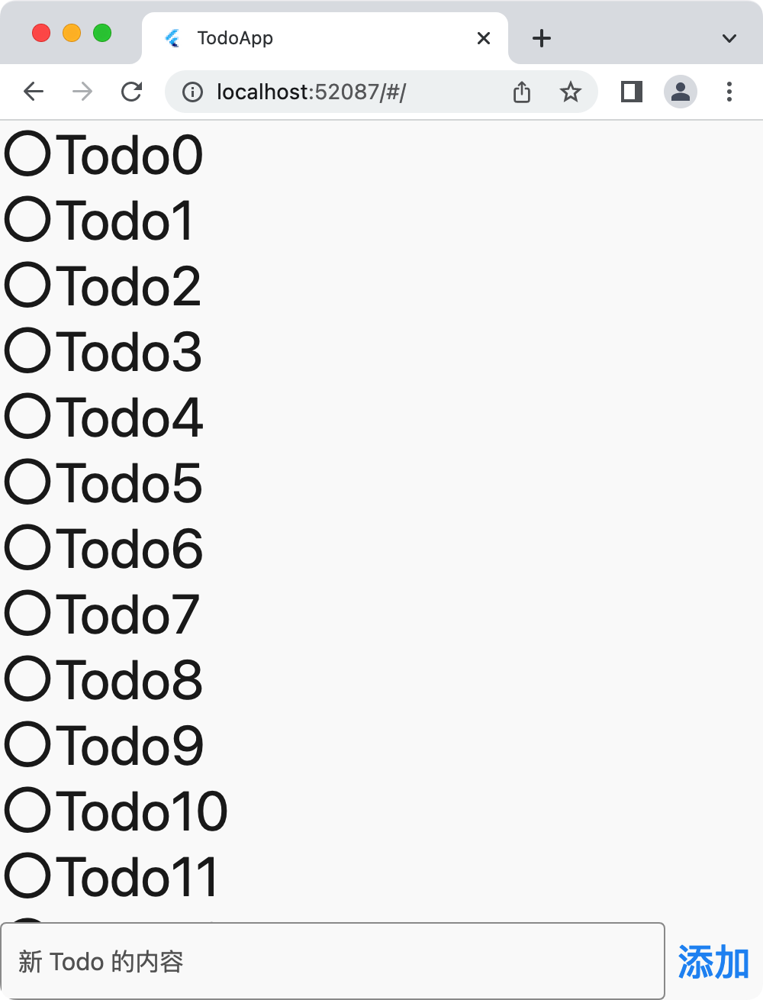
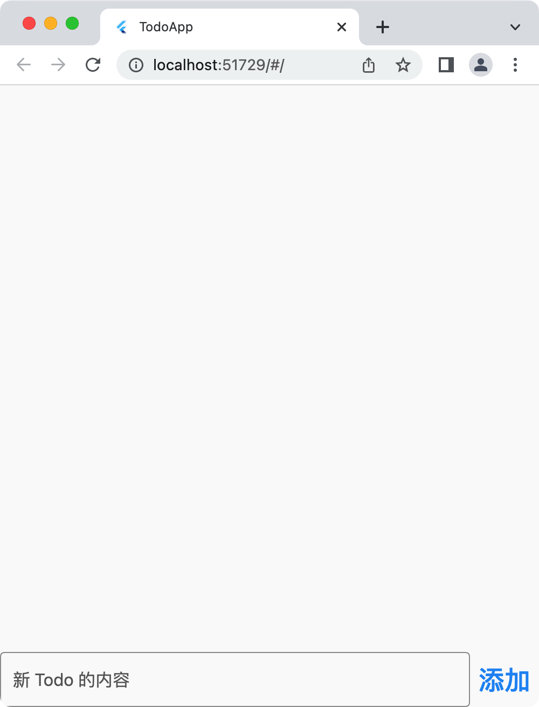
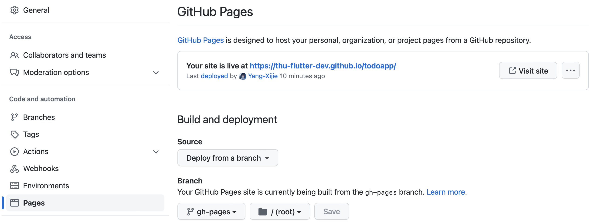

# TodoApp 设计开发全流程

这一节课我们将通过开发一个完整的应用 TodoApp 来快速了解 Flutter 构建应用的全流程。

TodoApp 大家可能也用过，类似备忘录的软件。一般可以把一些要做的事情记录进去，随时可以查看。在应用开发中，这也算是最简单的一种应用了。

## 数据结构设计

在实际动手开发之前，我们需要先想清楚应用中都有哪些数据。

对于一条 `Todo` 而言，用户在输入框中输入待办事项可以创建一条。那么这一条 `Todo` 至少要包含一个 `content`，类型是字符串。在展示多条 `Todo` 的时候，我们需要对它们进行排序，这里比较方便的是使用创建时间进行排序，因此我们还需要添加一个 `createdAt` 的时间戳。因为每一条 `Todo` 都是唯一的，所以我们再添加一个 `UUID`，以后查找某一条 `Todo` 就可以通过 `UUID` 来找。

<!-- TODO 这里最好添加一下 UUID 的定义 -->

但是我们第一节课演示不需要这么复杂，我们只需要 `content` 和 `number` 这两个值就可以了。

在使用 Flutter 构建应用程序的过程中，我们使用的语言是 Dart。这是 Google 创造的一门新语言，说的是对应用开发专门优化过。Dart 是一门面向对象的语言，因为面向对象是很适合 UI 构建的；Dart 也和诸多现代语言一样支持函数编程、协议扩展等多种便捷的操作。

使用 Dart 定义一个 `Todo` 类如下：

```dart
class Todo {
  int number = 0;
  String content = "";

  Todo(int number, String content) {
    this.number = number;
    this.content = content;
  }
}
```

或者使用 initializing formal parameters 简写为：

```dart
class Todo {
  int number = 0;
  String content = "";

  Todo(this.number, this.content);
}

void main(List<String> arguments) {
  Todo a = Todo(0, "完成课堂作业");
  Todo b = Todo(1, "看课件预习");
  print("${a.number} ${a.content}");
  print("${b.number} ${b.content}");
}
// $ dart run
// Building package executable... 
// Built dartlearn:dartlearn.
// 0 完成课堂作业
// 1 看课件预习
```

继续考虑数据结构，要展示多条 `Todo`，还需要一个数组来存放现有的 `Todo`。

```dart
class Todo {
  int number = 0;
  String content = "";

  Todo(this.number, this.content);
}

class TodoList {
  List<Todo> data = [];
  int count = 0;
}
```

- `List<Todo>` 的 `List` 是一种类型，也就是我们常说的数组。这里的 `<Todo>` 是范型，指这一种 `List` 中数据的类型为 `Todo`，也就是我们创建了一个名为 `data` 的 `Todo` 数组。

到这里 TodoApp 的数据已经定义结束了。但是我们还需要定义一些用户操作，比如用户添加一个 `Todo`；一件事情做完了，用户需要完成某件 `Todo`，这时我们考虑直接删除掉这一条 `Todo`。

```dart
class Todo {
  int number = 0;
  String content = "";

  Todo(this.number, this.content);
}

class TodoList {
  List<Todo> data = [];
  int count = 0;

  void insert(String content) {
    data.add(Todo(count, content));
    count += 1;
  }

  void delete(int number) {
    data.removeWhere((todo) {
      return todo.number == number;
    });
  }

  void display() {
    for (final todo in data) {
      print("${todo.number} ${todo.content}");
    }
  }
}

void main(List<String> arguments) {
  TodoList todoList = TodoList();
  todoList.insert("完成课堂作业");
  todoList.insert("看课件预习");
  todoList.display();
  todoList.delete(0);
  todoList.display();
}
// $ dart run
// Building package executable... 
// Built dartlearn:dartlearn.
// 0 完成课堂作业
// 1 看课件预习
// 1 看课件预习
```

- `data.add(...)`: `add()` 方法可以给数组末尾添加一个新值。
- `data.removeWhere((todo) { return todo.number == number; });` 这里 `removeWhere()` 函数的参数是一个函数，这个函数的输入为一个 `Todo`，输出为 `bool` 值；如果 `bool` 值为 `True`，那么这个值就会被移除掉。这里算是函数式编程的思想，往函数中传递一个函数。
- `for (final todo in data) { ... }` 一个标记为 `final` 的变量只能被赋值一次。这里只读取出数组中的数据进行显示。

## UI/UX 设计

数据结构设计完之后我们要考虑如何将这些数据显示到屏幕上，当然最终我们是需要 Flutter 这个框架将其实现，但是在早期阶段，我们需要使用 UI/UX 设计工具先简单画一下我们脑中的想法，这样子之后照着设计稿去写代码效率是更高的。

这里我十分推荐 [Figma](https://www.figma.com/) 这款 UI 设计工具，Figma 简单易上手，网页端的优化做的很好，团队协作功能超强。可以说是从入门到进阶都可以使用使用的一款 UI 设计工具。

打开网站之后注册或者登陆账号，新建一个 Draft 就可以开始画 UI 了。左上角点击长方形的框，我们先把手机的框画出来。随便画一个长方形就行了。


画好之后点击这个矩形，在右侧可以调整宽高、圆角度数、颜色等信息。


接下来我们要考虑怎么把界面元素放上去：

- TodoApp 的数据 `todoList.data` 可以用一个上下滚动的视图显示出来
- 用户需要添加一条 `Todo` 的时候，也就是需要调用 `todoList.insert()` 时，应该有一个文本输入框接收用户输入，然后有一个确认键添加这一条 `Todo`。类似微信下方发送消息的输入框和右侧的发送键。
- 用户完成一条 `Todo` 的时候，也就是需要调用 `todoList.delete()` 时，需要在一条 `Todo` 上进行操作。比如长按出现一个菜单其中包含「完成」按钮。这里我们直接将「完成」按钮放在 `todo.content` 的左侧，用户点击左侧的「完成」按钮之后，这一条 `Todo` 就会消失。

然后继续在 Figma 中画 UI 吧。利用矩形、文字这些基础的组件，调整大小、圆角度数，可以画出一个下方的输入区：



- 用 `cmd / ctrl G` 来让有关系的组件成组，方便后续查看和修改。
- 注意层级遮挡关系，在左侧可以看到当前界面所有的元素，在上方的组件会遮挡下方的组件。

同理，我们画出一个 Todo，然后成组，然后复制出另一个 Todo。这里我们希望有更多的 Todo，于是选中两个现有的 Todo，再次进行复制移动。可是这里间距不一致，我们可以使用 Figma 提供的排版工具，`Tidy up` 一下就整齐了。


完成效果图如下：



## 安装 Flutter 准备开发环境

画好 UI、想好 UX 之后，我们开始用 Flutter 来做 TodoApp。

Flutter 是 Google 推出的一款是声明式 UI 构建框架，其借鉴了前端 React 框架的思想，将用户界面视为 App 中所有状态的映射，也即，用这些状态渲染出当前的界面 UI。下一节课我们会详细讲讲 Flutter 背后的一些原理，这节课我们只要知道 Flutter 一个大致的用法就行了。

安装请查看 [安装 Flutter](./flutter-installation.md) 这篇文章。

安装成功后，你还需要一款编辑器，这里推荐使用 [VS Code](https://code.visualstudio.com)，打开后还需要安装 Dart 和 Flutter 这两款官方的插件。

同时你需要安装模拟器方便在开发的过程中查看应用的效果。请查看：

- [在 Windows 上创建打开 Android 模拟器进行调试](./simulator-windows-android.md)
- [在 macOS 上创建打开 Android 模拟器进行调试](./simulator-macos-android.md)
- [在 macOS 上创建打开 iOS 模拟器进行调试](./simulator-macos-ios.md)

开模拟器对电脑性能有着不小的开销……我这里使用 Chrome 进行调试。

有同学会问，我们不是移动应用开发课程吗，为什么会用到 Chrome 呢？这就要说到 Flutter 的跨平台特性了。Flutter 现在支持的发布渠道有 Android、iOS、Windows、macOS、Linux、网页端，能支持全平台的原因是，Flutter 框架做的事情只是在一块 `height*width` 的画布上渲染出 UI。因此我们只要把 Chrome 拉成竖屏的分辨率，其实在开发阶段是会方便一些的。当然最终也需要在模拟器和真机上运行，这样才能确保应用实际可用（比如在电脑端输入就不会从下方弹出键盘占界面）。当然你也可以直接发布成网页版在手机浏览器中打开。

## 创建项目

使用 `flutter create todoapp` 在当前工作目录创建名为 `todoapp` 的 Flutter 项目，用 `code todoapp` 即可在 VS Code 中打开改项目。

打开之后我们最好先用 Git 初始化一下（`.gitignore` 文件在创建项目的时候已经创建了），结合 VS Code 的源代码管理能够看到代码的修改情况。 `git init` `git add` `git commit -m "init"`。

### 项目结构

项目的结构如下：

```
.
├── .dart_tool/
├── .git/
├── .gitignore
├── .idea/
├── .metadata
├── README.md
├── analysis_options.yaml
├── android/
├── ios/
├── lib/
├── linux/
├── macos/
├── pubspec.lock
├── pubspec.yaml
├── test/
├── todoapp.iml
├── web/
└── windows/
```

- `lib/` 中是程序的源代码，也是之后我们添加代码主要的地方。应用从 `lib/main.dart` 的 `main()` 函数开始执行。
- `test/` 中是测试文件，我们可以直接删除 `test/widget_test.dart` 这个文件。
- `android/` `ios/` `windows/` `macos/` `linux/` `web/` 是各个目标平台特有的代码，在需要定制一些目标平台的项目时需要将目标平台的原生代码放到这些目录下，或者打开对应的项目进行修改。
- `pubspec.yaml` 项目配置和依赖管理。
- `analysis_options.yaml` Dart 语言 linter 配置。

### 关于 analysis_options

新建项目之后，在 `analysis_options.yaml` 的 `linter > rules` 下面添加 `prefer_const_*` 以防止 `Dart` 不停提示添加或移除 `const`：

```yaml
linter:
  rules:
    # avoid_print: false  # Uncomment to disable the `avoid_print` rule
    # prefer_single_quotes: true  # Uncomment to enable the `prefer_single_quotes` rule
    prefer_const_constructors: false
    prefer_const_constructors_in_immutables: false
    prefer_const_literals_to_create_immutables: false
```

在学习阶段，我很推荐这么做。否则你会在 VS Code 中看到大片蓝色波浪线，且不断看到下面的提示：`Prefer const with constant constructors.`。甚至按照提示加了 `const` 关键字之后再修改还会直接导致代码出错。

在项目实际需要发布的时候，将这三条新加的 rules 删除或注释掉，添加这些 `const` 关键字使得不会变的 `Widget`s 只被创建一次，提高应用的性能。

### Hello, world!

接下来我们创建一个显示 `Hello, world!` 的应用。我们删除掉 `lib/main.dart` 中的全部内容，替换为下面的内容：

```dart
import 'package:flutter/material.dart';

void main() {
  runApp(MyApp());
}

class MyApp extends StatelessWidget {
  MyApp({super.key});

  @override
  Widget build(BuildContext context) {
    return MaterialApp(
      title: "TodoApp",
      home: Scaffold(body: ContentWidget()),
      debugShowCheckedModeBanner: false,
    );
  }
}

class ContentWidget extends StatelessWidget {
  ContentWidget({super.key});

  @override
  Widget build(BuildContext context) {
    return Center(
      child: Text("Hello, world!"),
    );
  }
}
```

#### 运行

先别管里面写了什么，保存文件，`ctrl J / cmd J` 调出 VS Code 的终端。先输入 `flutter devices` 查看本机连接的设备：

```
Chrome (web) • chrome • web-javascript • Google Chrome
```

我们使用 Chrome 来运行 `Hello, world!` 程序，在终端输入 `flutter run -d chrome --web-renderer html` 回车稍等片刻即可看到运行的应用了。

- `-d` 后面跟的是目标平台，只要输入 `flutter devices` 结果中的前几个字母就行了，可以匹配
- `flutter run -d chrome` 运行得到的程序对 Unicode 的支持很差，这里我们选择另一种构建方式。关于网页应用两种构建方式的区别见 https://docs.flutter.dev/development/platform-integration/web/renderers


- 拖拽 Chrome 边框，可以看到 `Hello, world!` 总是在屏幕中心。
- 修改 `Text("Hello, world!")` 中的字符串为任意内容，在终端按 `r` 或 `R` 即可热更新，Chrome 呈现的应用会更新显示内容。
- 在终端按 `q` 即可结束应用运行，也可以直接点击关闭或者退出结束应用。

#### 代码讲解

- L1
    - `import 'package:flutter/material.dart';` 导入了官方的 `material` 包。Material Design 是 Google 官方制定的一套设计标准，其中各种常用的包含 UI 组件、UX 交互、主题样式等信息。Flutter 支持使用 Material Design，这能够减少我们重复造轮子。
- L3
    - `void main()` 程序从这里开始运行
- L4
    - 鼠标放到 `runApp` 上方，可以看到函数原型是 `void runApp(Widget app)`。在 Flutter 中，所有的界面元素都是一个 `Widget`。这里我们实例化一个 `MyApp()` 传入 `runApp()`。
- L7
    - `extends` 关键字表示继承。`MyApp` 是 `StatelessWidget` 的一个子类。
    - 在 Flutter 中，Widget 都由两种基类继承而来：`StatelessWidget` 和 `StatefulWidget`，无状态 Widget 和有状态 Widget。
- L8
    - 关于 key，可以查看 <https://docs.flutter.dev/development/ui/widgets-intro> 的 Keys 部分。
- L10
    - `@override` 表示下面的函数重写父类的方法
- L11
    - `Widget build(BuildContext context)` 这个函数，也就是 `build()` 函数，是 Flutter 中构建用户界面的关键。可以看到 `build()` 函数的返回值是一个 `Widget`。你可以配合各种参数使用一些基础的组件来构建出一个新的 Widget，然后返回即可。
    - `context` 中有一些 Widget 之间传递的信息，这一节课我们暂时不用考虑。
- L12-L16
    - `MaterialApp` 可以说是一个 Widget。我们传入了三个参数：
        - `title` 应用展示的名称。可能出现在浏览器标签栏，或者在任务管理器。
        - `home` 当前应用的主页，打开应用之后呈现这个界面。
        - `debugShowCheckedModeBanner` 是否显示右上角的开发提示。这里我们关闭。
    - 一般使用 Flutter 构建应用我们都会使用 `MaterialApp` 作为应用的「根」，即使你可能并不使用 Material Design，其中实现了很多大多数都需要的功能，比如主题管理、字体样式管理等。按照需求传递参数进行配置即可，十分方便。
- L14
    - `Scaffold(body: ContentWidget())` 这里 `Scaffold` 可以理解为「一页」，或者说这是对传入 `body` 的界面的一个升级，在这「一页」添加了一些 Material Design 常用的视觉元素和视觉效果。
- L25-L27
    - `Center` 也是一个 `Widget`，可以说，Flutter 中不论是 UI 组件还是布局，通通都是 `Widget`，
    - `child` 参数传入另一个 Widget，也就是需要 `Center` 这个 Widget 居中的 Widget，这样就组成了一个树状结构。结合上面的代码，现在的结构是：`MaterialApp` > `Scaffold` > `ContentWidget` > `Center` > `Text`。
    - `Text` Widget 的第一个参数是要显示的文字，还有很多参数可以配置。比如我们这里尝试将 `Hello, world!` 调大一些：在 `Text` 的初始化列表中添加 `style: TextStyle(fontSize: 36)`，终端按 `r` 或 `R` 刷新，就可以看到放大后的字体了。

## StatelessWidget 呈现整个 UI

### Column

接下来我们就需要用 Flutter 来构建 TodoApp 了。

在 `lib/` 下新建一个文件，名为 `model.dart`，我们需要将之前定义的数据结构拿过来：

```dart
class Todo {
  int number = 0;
  String content = "";

  Todo(this.number, this.content);
}

class TodoList {
  List<Todo> data = [];
  int count = 0;

  TodoList(List<String> contents) {
    List<Todo> data = [];
    for (int i = 0; i < contents.length; i++) {
      data.add(Todo(i, contents[i]));
    }
    this.data = data;
  }

  void insert(String content) {
    data.add(Todo(count, content));
    count += 1;
  }

  void delete(int number) {
    data.removeWhere((todo) {
      return todo.number == number;
    });
  }
}

TodoList todoList = TodoList([
  "完成课堂作业",
  "看课件预习",
]);
```

- L12-18
    - 这里对构造函数有了一些修改，我们可以通过传入一个字符串数组来初始化 `data`。
- L32
    - 这里直接将 `todoList` 声明为全局变量，在第一节课的演示中，这是可以的；但事实上这是一种很不好的编程习惯，我们在后面会通过状态管理解决这个问题。

接下来我们修改 `lib/main.dart` 来显示这两条 Todo：

```dart
import 'package:flutter/material.dart';
import 'model.dart';

void main() {
  runApp(MyApp());
}

class MyApp extends StatelessWidget {
  MyApp({super.key});

  @override
  Widget build(BuildContext context) {
    return MaterialApp(
      title: "TodoApp",
      home: Scaffold(body: ContentWidget()),
      debugShowCheckedModeBanner: false,
    );
  }
}

class ContentWidget extends StatelessWidget {
  ContentWidget({super.key});

  @override
  Widget build(BuildContext context) {
    return Center(
      child: Column(
        children: [
          TodoWidget(content: todoList.data[0].content),
          TodoWidget(content: todoList.data[1].content),
        ],
      ),
    );
  }
}

class TodoWidget extends StatelessWidget {
  final String content;

  TodoWidget({super.key, this.content = ""});

  @override
  Widget build(BuildContext context) {
    return Row(
      children: [
        Icon(
          Icons.circle_outlined,
          size: 36,
        ),
        Text(
          content,
          style: TextStyle(fontSize: 36),
        ),
      ],
    );
  }
}
```

效果：



代码解释：

- L37-57
    - 这里新定义了一个 `TodoWidget` 用来显示一条 `Todo`。按照之前 UI 稿上画的样式，我们用 `Row` 的参数 `children` 将左侧的圆圈和右侧的文字放在一起即可。
    - L38 这里使用了 `final` 关键字，这是因为 `TodoWidget` 接收到的 `content` 是不会变的。这里有同学可能会问，明明可以传入不同的 `content` 啊。这里就要说到 Flutter 的渲染机制了。对于一个 `StatelessWidget` 来说，如果参数改变，那么这个 `StatelessWidget` 会重新绘制，也就是说，把之前的对象析构掉，然后创建一个新的。又有同学会问，不停销毁创建不会有性能上的问题吗？事实上 Flutter 对 `build()` 函数做了很多优化，可以确保这一个过程足够快。
- L27-32
    - 这里我们的 `todoList`只有两个，直接使用 `Column` 进行呈现。
    - 可以看到，因为我们提前定义了 `TodoWidget`，所以在 `ContentWidget` 中就可以直接使用 `TodoWidget`，层级结构更清晰，也减少了重复的代码量。
    - 注意 Dart 是编译型语言，我们可以不按照使用的先后顺序来放置类或函数，反方向按照应用的层级结构放置代码更清晰一些。

### ListView

我们继续增加 Todo 的数量。`lib/model.dart`：

```dart
TodoList todoList = TodoList([
  "Todo0",
  "Todo1",
  "Todo2",
  "Todo3",
  "Todo4",
  "Todo5",
  "Todo6",
  "Todo7",
  "Todo8",
  "Todo9",
  "Todo10",
  "Todo11",
  "Todo12",
  "Todo13",
  "Todo14",
  "Todo15",
  "Todo16",
  "Todo17",
  "Todo18",
  "Todo19",
  "Todo20",
  "Todo21",
  "Todo22",
  "Todo23",
  "Todo24",
]);
```

这时我们希望在 `Column` 中将这些 `Todo` 全部显示，修改 `lib/main.dart` 中的 `ContentWidget`：

```dart
class ContentWidget extends StatelessWidget {
  ContentWidget({super.key});

  @override
  Widget build(BuildContext context) {
    return Center(
      child: Column(
        children:
            todoList.data.map((e) => TodoWidget(content: e.content)).toList(),
      ),
    );
  }
}
```

修改好后保存按 `R` 热加载，可以看到下面的情况：


这是因为 `Column` 这个 Widget 是不支持滚动的，超过显示范围的话就无法显示了。这里我们换用 `ListView` 这个 Widget：直接将上面代码的 `Column` 换成 `ListView` 即可，它们都有 `children` 这个参数。

修改好后再次运行发现已经可以上下滑动看到所有的 Todo 了。

## 添加输入框

输入文字内容是一个很必要的交互，下面我们添加一个输入框 `TextField`，继续修改 `ContentView`：

```dart
class ContentWidget extends StatelessWidget {
  ContentWidget({super.key});

  @override
  Widget build(BuildContext context) {
    return Column(
      children: [
        Expanded(
          child: ListView(
            children: todoList.data
                .map((e) => TodoWidget(content: e.content))
                .toList(),
          ),
        ),
        TextField(
          decoration: InputDecoration(
            border: OutlineInputBorder(),
            labelText: '添加一条新的Todo',
          ),
        )
      ],
    );
  }
}
```

- 因为上方的展示列表和下方的输入框是上下关系，所以我们将它们放到一个 `Column` 里面。但是这里如果直接使用 `ListView`，运行应用你会发现持续在报错。原因可以查看<https://stackoverflow.com/questions/45669202/how-to-add-a-listview-to-a-column-in-flutter>。解决方案是我们需要限制 `ListView` 的高度，加上一个 `Expanded` 将 `ListView` 包起来即可。
- 这里的 `TextField` 其实只是一个装饰，用户现在确实可以往里面填文字，但是我们没法拿到里面的文字。

运行应用，可以看到下方的效果：




## 添加新增 Todo

我们需要往下方添加的内容开始增多，我们选择将下方的这个 `Widget` 单独提出来命名为 `AddTodoWidget`（注：在 VS Code `中敲stl` 回车就可以选择快速补全 `StatelessWidget`）：

```dart
class ContentWidget extends StatelessWidget {
  ContentWidget({super.key});

  @override
  Widget build(BuildContext context) {
    return Column(
      children: [
        Expanded(
          child: ListView(
            children: todoList.data
                .map((e) => TodoWidget(content: e.content))
                .toList(),
          ),
        ),
        AddTodoWidget()
      ],
    );
  }
}
```

```dart
class AddTodoWidget extends StatelessWidget {
  AddTodoWidget({super.key});

  @override
  Widget build(BuildContext context) {
    return Row(
      children: [
        Expanded(
          child: TextField(
            decoration: InputDecoration(
              border: OutlineInputBorder(),
              labelText: '新 Todo 的内容',
            ),
          ),
        ),
        TextButton(
            onPressed: () {
              debugPrint("添加按钮按下");
            },
            child: Text(
              "添加",
              style: TextStyle(fontSize: 24),
            ))
      ],
    );
  }
}
```

这里也用到了 `Expanded` 这个 `Widget`，否则 `TextField` 的宽度会无限增长导致界面无法显示。这里 `TextButton` 是一种效果最简单的 `Button`，在点击这个按钮时，控制台会输出「添加按钮按下」。



然后我们需要将输入框和「添加」按钮关联起来，这里我们用一个 `Controller` 拿出 `TextField` 的文字值，然后按下 `TextButton` 的时候将新的 Todo 添加到 `todoList.data` 中：

这里我们删除刚刚创建的 StatelessWidget `AddTodoWidget`，新建一个 StatefulWidget `AddTodoWidget`（注：在 VS Code 中敲 `stf` 回车就可以快速补全 `StatefulWidget`）：

```dart

class AddTodoWidget extends StatefulWidget {
  AddTodoWidget({super.key});

  @override
  State<AddTodoWidget> createState() => _AddTodoWidgetState();
}

class _AddTodoWidgetState extends State<AddTodoWidget> {
  final textFieldController = TextEditingController();

  @override
  void dispose() {
    // Clean up the controller when the widget is disposed.
    textFieldController.dispose();
    super.dispose();
  }

  @override
  Widget build(BuildContext context) {
    return Row(
      children: [
        Expanded(
          child: TextField(
            controller: textFieldController,
            decoration: InputDecoration(
              border: OutlineInputBorder(),
              labelText: '新 Todo 的内容',
            ),
          ),
        ),
        TextButton(
            onPressed: () {
              debugPrint("添加按钮按下 内容为${textFieldController.text}");
            },
            child: Text(
              "添加",
              style: TextStyle(fontSize: 24),
            ))
      ],
    );
  }
}
```

- Dart 使用 `$` 进行字符串差值，比如 `print("i=$i");` `内容为${textFieldController.text}`；简单变量可以不加大括号。
- 这里我们给 `TextField` 添加了一个 controller `textFieldController`，使用 `textFieldController.text` 即可拿到 `TextField` 的当前值。
- 我们之前用的都是 `StatelessWidget`，这里因为需要一个跟随 `Widget` 的变量——`textFieldController`，因此我们需要将 `AddTodoWidget` 改为 `StatefulWidget`。
    - 在 Flutter 中，`StatefulWidget` 可以有很多个变量作为 Widget 的状态，每当这些状态有变化的时候，Widget 会对应「刷新」——但是不会销毁之前的 Widget 而重新创建。对比 `StatelessWidget`，尽管其可以传入参数，当参数改变的时候，其也会「刷新」，但是这里的「刷新」是指销毁之前的 Widget，然后重新创建一个。
    - 考虑到 `TextField` 的使用场景，你希望有一个变量能够记录 `TextField` 当前的文字值，每当这个文字值改变的时候 `TextField` 要「刷新」显示新的文字值，但是你不希望在刷新这个过程中重新创建 `TextField` 让用户的输入清零。
    - `StatefulWidget` 的写法有些复杂，这是由 Dart 的特性和其功能决定的。本身写法比较约定俗成，记得使用 `stf` 回车自动补全。

接下来我们添加逻辑，在 `debugPrint("添加按钮按下 内容为${textFieldController.text}");` 后回车加入：

```dart
todoList.insert(textFieldController.text);
print(todoList.data.length);
textFieldController.text = "";
```

逻辑很简单，添加一条 Todo 然后把输入框清空。重新运行程序，让我们意外的事情发生了——输入框是清空了，但是界面上没有显示出新的 Todo。这里用常理推断，程序肯定正常运行了，也就是 `todoList.data` 确实得到了添加，因为 `todoList.data.length` 一直在增加。

那么问题就出在数据源 `todoList.data` 和 Flutter 框架构建的 UI 并没有建立某种联系。我们希望 `todoList.data` 被改动时 UI 也能进行刷新。一听这个需求，这不就是 `StatefulWidget` 做的事情吗？接下来我们将 `todoList` 改为 `StatefulWidget` 里面的一个变量/状态。

## StatefullWidget 呈现 todoList

首先我们需要考虑什么东西是变的：不是 `todoList`，而是 `todoList.data` 和 `todoList.count`；但是在 Flutter 框架中，为了简洁我们不需要声明两个变量/状态（`List<String>` 和 `int`），我们只需要一个状态 `todoList` 就可以了。

既然 `todoList` 是一个状态，那它肯定要放到 `StatefulWidget` 里面，而不能是一个全局变量。而每次对 `todoList` 的修改，我们不仅仅需要修改数据本身，还要告诉 Flutter 框架需要更新用户界面，因此像 `insert()` 这种修改的函数，我们放到 `StatefulWidget` 里去写。

注：下面的代码非常繁琐，事实上我们之后会用更简单的方式去添加应用的状态，这部分简单看看即可。

**lib/model.dart**

```dart
class Todo {
  int number = 0;
  String content = "";

  Todo(this.number, this.content);
}

class TodoList {
  List<Todo> data = [];
  int count = 0;

  TodoList(List<String> contents) {
    List<Todo> data = [];
    for (int i = 0; i < contents.length; i++) {
      data.add(Todo(i, contents[i]));
    }
    this.data = data;
  }
}

List<String> defaultTodoContents = [
  "Todo0",
  "Todo1",
  "Todo2",
  "Todo3",
  "Todo4",
  "Todo5",
  "Todo6",
  "Todo7",
  "Todo8",
  "Todo9",
  "Todo10",
  "Todo11",
  "Todo12",
  "Todo13",
  "Todo14",
  "Todo15",
  "Todo16",
  "Todo17",
  "Todo18",
  "Todo19",
  "Todo20",
  "Todo21",
  "Todo22",
  "Todo23",
  "Todo24",
];
```

- 可以看到只保留了 `Todo` 和 `TodoList` 的数据结构，移除了操作函数 `insert()`（这里 `delete()` 被略去）。
- 为了简洁，我们将字符串数字 `defaultTodoContents` 单独放出来成为一个全局变量，方便我们调试。

**lib/main.dart**

```dart
import 'package:flutter/material.dart';
import 'model.dart';

void main() {
  runApp(MyApp(defaultTodoContents: defaultTodoContents));
}

class MyApp extends StatefulWidget {
  final List<String> defaultTodoContents;

  MyApp({super.key, required this.defaultTodoContents});

  @override
  State<MyApp> createState() => _MyAppState();
}

class _MyAppState extends State<MyApp> {
  late TodoList todoList;

  @override
  initState() {
    super.initState();

    todoList = TodoList(widget.defaultTodoContents);
  }

  void insert(String content) {
    setState(() {
      todoList.data.add(Todo(todoList.count, content));
    });
    todoList.count += 1;
  }

  @override
  Widget build(BuildContext context) {
    return MaterialApp(
      title: "TodoApp",
      home: Scaffold(
          body: ContentWidget(
        todoList: todoList,
        insert: insert,
      )),
      debugShowCheckedModeBanner: false,
    );
  }
}

class ContentWidget extends StatelessWidget {
  final TodoList todoList;
  final ValueChanged<String> insert;

  ContentWidget({super.key, required this.todoList, required this.insert});

  @override
  Widget build(BuildContext context) {
    return Column(
      children: [
        Expanded(
          child: ListView(
            children: todoList.data
                .map((e) => TodoWidget(content: e.content))
                .toList(),
          ),
        ),
        AddTodoWidget(
          todoList: todoList,
          insert: insert,
        )
      ],
    );
  }
}

class AddTodoWidget extends StatefulWidget {
  final TodoList todoList;
  final ValueChanged<String> insert;

  AddTodoWidget({super.key, required this.todoList, required this.insert});

  @override
  State<AddTodoWidget> createState() => _AddTodoWidgetState();
}

class _AddTodoWidgetState extends State<AddTodoWidget> {
  final textFieldController = TextEditingController();

  @override
  void dispose() {
    // Clean up the controller when the widget is disposed.
    textFieldController.dispose();
    super.dispose();
  }

  @override
  Widget build(BuildContext context) {
    return Row(
      children: [
        Expanded(
          child: TextField(
            controller: textFieldController,
            decoration: InputDecoration(
              border: OutlineInputBorder(),
              labelText: '新 Todo 的内容',
            ),
          ),
        ),
        TextButton(
            onPressed: () {
              debugPrint("添加按钮按下 内容为${textFieldController.text}");
              widget.insert(textFieldController.text);
              textFieldController.text = "";
            },
            child: Text(
              "添加",
              style: TextStyle(fontSize: 24),
            ))
      ],
    );
  }
}

class TodoWidget extends StatelessWidget {
  final String content;

  TodoWidget({super.key, this.content = ""});

  @override
  Widget build(BuildContext context) {
    return Row(
      children: [
        Icon(
          Icons.circle_outlined,
          size: 36,
        ),
        Text(
          content,
          style: TextStyle(fontSize: 36),
        ),
      ],
    );
  }
}
```

- L8-17
    - 我们需要添加一个状态，类型是 `TodoList`，这个状态属于 TodoApp，而不仅仅属于一个小的局部的 Widget（对比 `AddTodoWidget` 的 `textFieldController`）。因此我们将 `MyApp` 从 StatelessWidget 改为 StatefulWidget。
- L18-L25
    - `TodoList todoList;` 这里创建了 `todoList` 作为 `MyApp` 的一个状态。
    - `initState()` 中对 `todoList` 这个状态进行了初始化。
    - `late` 关键字：如果不加的话，会报错 `Non-nullable instance field 'todoList' must be initialized. Try adding an initializer expression, or a generative constructor that initializes it, or mark it 'late'. dart(not_initialized_non_nullable_instance_field)`
- L27-32
    - 逻辑上和之前的 `insert()` 一样。但是这里加入了 `setState()`，其参数是一个函数，在这个函数对状态进行修改，Flutter 就可以对界面进行更新。
    - `todoList.count += 1;` 并没有放入 `setState()`，这是因为我们暂时没有在 UI 中用到 `count` 这个变量。
    - `todoList` 是 `MyApp` 的一个状态，我们只能将 `insert()` 放入 `_MyAppState` 中。
- L48-49
    - 注意 `ContentWidget` 仍然是 `StatelessWidget`，这说明 `final TodoList todoList;` 这里 `todoList` 不是状态，只是一个参数。每次传入的 `todoList` 发生变化，`ContentWidget` 会被销毁并重新创建。
- L110
    - 当「添加」按钮被按下时，我们需要修改 `MyApp` 中的状态 `todoList`，也就是调用 `_MyAppState` 中的 `insert()`。
    - 这是一件相当麻烦的事情，因为在子 Widget 中调用父 Widget 中的函数，我们只能将其作为回调函数来传递。
        - L110 的 `widget.insert()` 调用了 L76 的 `final ValueChanged<String> insert;`
        - L78 的 `required this.insert` 由 L67 传入
        - L67 使用的是 L50 的 `final ValueChanged<String> insert;`
        - L52 的 `required this.insert` 由 L41 传入
    - 关于 ValueChanged
        - 首先明确，在 Dart 中，函数和变量的地位是一样的。变量可以作为函数的参数，函数一样可以作为函数的参数。
        - 变量由类型，函数也有类型，这个类型是 `Function`。
        - 这里所有的 `insert()` 的类型是 `void Function(T value)`，参数为类型为 `T` 的值 `value`，无返回值（返回值为 `void`）。
        - 为了简化这种比较常用的函数类型，Dart 做了一个 `typedef`：`typedef ValueChanged<T> = void Function(T value);`
            - Signature for callbacks that report that an underlying value has changed.
            - https://api.flutter.dev/flutter/foundation/ValueChanged.html
            - https://stackoverflow.com/a/62799524/14298786

这时我们再运行，可以看到添加之后的内容已经成为新的 Todo 显示在上方了。

上面的方式异常繁琐，牵扯到父 Widget 和子 Widget 来回传递数据。我们现在的 TodoApp 只有一个状态，就已经变得这么麻烦，很难想象单纯有上面的方式创建一个现代的应用有多么复杂。

事实上，我们现在多少了解了 Flutter 的声明式特性：

- 界面是什么样子的，你只需要用树形的结构使用代码将界面声明出来。
- 界面呈现的数据，不变的内容用常量，可变的内容用状态。

## Provider 状态管理

为了管理应用中各种复杂的状态，一些状态管理框架应运而生。这其中官方推荐的框架是 `Provider`。

在谈到 Provider 之前，我们先说说有哪些 State：

- 首先是一个 Widget 的状态，比如我们需要存储一个文本框的文字状态、存储一个开关的状态，这些与整个应用的关系不大，继续使用 `StatefulWidget` 即可。
- 其次是属于应用的状态，比如 TodoApp 中的 `todoList`，它存储了用户数据，我们最好将其抽出来统一管理，而不是和用户界面混在一起。对于这种状态，我们使用 Provider 进行管理。

要在项目中加入 Provider，我们在 `pubspec.yaml` 中的 `dependencies` 中加入 `provider: ^6.0.5`，保存即可。

**lib/model.dart**

```dart
import 'package:flutter/material.dart';

class Todo {
  int number = 0;
  String content = "";

  Todo(this.number, this.content);
}

class TodoListModel extends ChangeNotifier {
  // source of states
  List<Todo> data = [];
  int count = 0;

  TodoListModel(List<String> contents) {
    List<Todo> data = [];
    for (int i = 0; i < contents.length; i++) {
      data.add(Todo(i, contents[i]));
    }
    this.data = data;
  }

  void insert(String content) {
    data.add(Todo(count, content));
    count += 1;
    notifyListeners(); // re-build widgets
  }

  void delete(int number) {
    data.removeWhere((todo) {
      return todo.number == number;
    });
    notifyListeners(); // re-build widgets
  }
}

List<String> defaultTodoContents = [
  "Todo0",
  "Todo1",
  "Todo2",
  "Todo3",
  "Todo4",
  "Todo5",
  "Todo6",
  "Todo7",
  "Todo8",
  "Todo9",
  "Todo10",
  "Todo11",
  "Todo12",
  "Todo13",
  "Todo14",
  "Todo15",
  "Todo16",
  "Todo17",
  "Todo18",
  "Todo19",
  "Todo20",
  "Todo21",
  "Todo22",
  "Todo23",
  "Todo24",
];
```

- 可以看到之前的数据结构 `TodoList` 变为了 `TodoListModel`，是 `ChangeNotifier` 的一个子类。
- 在 `insert()` 和 `delete()` 中，我们使用 `notifyListeners()` 来告知所有和 `TodoListModel` 有关联的界面都要刷新，因为内部的数据变了。

**lib/main.dart**

```dart
import 'package:flutter/material.dart';
import 'package:provider/provider.dart';
import 'model.dart';

void main() {
  runApp(MyApp(defaultTodoContents: defaultTodoContents));
}

class MyApp extends StatelessWidget {
  final List<String> defaultTodoContents;
  const MyApp({super.key, required this.defaultTodoContents});

  @override
  Widget build(BuildContext context) {
    return MaterialApp(
      title: "TodoApp",
      home: Scaffold(
          body: ChangeNotifierProvider(
        create: (context) => TodoListModel(defaultTodoContents),
        child: ContentWidget(),
      )),
      debugShowCheckedModeBanner: false,
    );
  }
}

class ContentWidget extends StatelessWidget {
  ContentWidget({super.key});

  @override
  Widget build(BuildContext context) {
    return Column(
      children: [
        Expanded(
          child: Consumer<TodoListModel>(builder: (context, model, child) {
            return ListView(
              children: model.data
                  .map((todo) => TodoWidget(content: todo.content))
                  .toList(),
            );
          }),
        ),
        AddTodoWidget()
      ],
    );
  }
}

class AddTodoWidget extends StatefulWidget {
  AddTodoWidget({super.key});

  @override
  State<AddTodoWidget> createState() => _AddTodoWidgetState();
}

class _AddTodoWidgetState extends State<AddTodoWidget> {
  final textFieldController = TextEditingController();

  @override
  void dispose() {
    // Clean up the controller when the widget is disposed.
    textFieldController.dispose();
    super.dispose();
  }

  @override
  Widget build(BuildContext context) {
    return Row(
      children: [
        Expanded(
          child: TextField(
            controller: textFieldController,
            decoration: InputDecoration(
              border: OutlineInputBorder(),
              labelText: '新 Todo 的内容',
            ),
          ),
        ),
        Consumer<TodoListModel>(builder: (context, model, child) {
          return TextButton(
              onPressed: () {
                debugPrint("添加按钮按下 内容为${textFieldController.text}");
                model.insert(textFieldController.text);
                textFieldController.text = "";
              },
              child: Text(
                "添加",
                style: TextStyle(fontSize: 24),
              ));
        })
      ],
    );
  }
}

class TodoWidget extends StatelessWidget {
  final String content;

  TodoWidget({super.key, this.content = ""});

  @override
  Widget build(BuildContext context) {
    return Row(
      children: [
        Icon(
          Icons.circle_outlined,
          size: 36,
        ),
        Text(
          content,
          style: TextStyle(fontSize: 36),
        ),
      ],
    );
  }
}
```

- L18-21
    - 在 Flutter 中，几乎所有东西都是 Widget。这里 `ChangeNotifierProvider` 也是一个 Widget，所以其作为 `Scaffold` 的 `body` 传入。
    - 就作用来说，`ChangeNotifierProvider` 在 `ContentWidget` 上包了一层，在 `create()` 中初始化了 `TodoListModel`，这让所有 `ContentWidget` 的子 Widget 都能拿到 `TodoListModel`。
- L35-41
    - 这里我们就要去使用之前创建的 `TodoListModel` 了。这里用了类型判断的思想将 `TodoListModel` 传到子 Widget。`Consumer<TodoListModel>` 表示如果子 Widget 接收到了父 Widget 传来的类型为 `TodoListModel` 的 `ChangeNotifier`，那就会接收。
    - 在 `builder()` 中，我们使用 `model.data` 就可以拿出对应的 `TodoListModel` 中的数据了。
- L79-90
    - 与之前 `ListView` 同理，我们给 `TextButton` 包上一层 `Consumer<TodoListModel>`。这样我们就可以使用 `model.insert()` 了。

运行没问题，界面在添加后得到了刷新。

- "Put `ChangeNotifierProvider` above the widgets that need to access it." 可以感觉到，这里 `ChangeNotifierProvider` 类似一个全局变量，因为其内容会传给所有的子 Widget，我们尽量把它放到靠近向下（向子 Widget）的位置。
- 包裹某一个 Widget 的方法：右键 Widget，在弹出的菜单中选择 `Refactor...`，继续选择 `Wrap with xxx` 即可。

## 完成按钮

最后添加完成按钮，修改 `lib/main.dart` 中的 `TodoWidget`：

```dart
class TodoWidget extends StatelessWidget {
  final Todo todo;

  TodoWidget({super.key, required this.todo});

  @override
  Widget build(BuildContext context) {
    return Row(
      children: [
        Consumer<TodoListModel>(builder: (context, model, child) {
          return TextButton(
              onPressed: () {
                model.delete(todo.number);
              },
              child: Icon(
                Icons.circle_outlined,
                size: 36,
              ));
        }),
        Text(
          todo.content,
          style: TextStyle(fontSize: 36),
        ),
      ],
    );
  }
}
```

这里我们将 `TodoWidget` 的参数变为 `todo`，方便获取到 `todo` 的序号。因此要对应修改 `ListView` 的参数。

```dart
ListView(
  children:
    model.data.map((todo) => TodoWidget(todo: todo)).toList(),
)
```

再次运行，可以看到应用已经可以完成我们想要的功能了。


## 发布应用

### 完善应用

在发布应用之前，我们稍微再对应用做一些完善。

#### 清除调试数据

我们之前生命了一个全局变量 `defaultTodoContents` 用来调试查看效果，但是发布应用时我们肯定不希望用户看到这些。我们可以在启动应用之前对数据列表进行不同的初始化来实现这一点。

在 `lib/main.dart` 中引入 `kDebugMode`:

```dart
import 'package:flutter/foundation.dart' show kDebugMode;
```

再将 `main()` 修改为:

```dart
void main() {
  if (kDebugMode) {
    runApp(MyApp(defaultTodoContents: defaultTodoContents));
  } else {
    runApp(MyApp(defaultTodoContents: []));
  }
}
```

这时我们使用 `flutter run -d chrome --web-renderer html` 可以看到应用刚刚打开可以看到有多条 Todo 方便调试。但使用 `flutter run -d chrome --web-renderer html --release` 可以看到打开应用之后一条 Todo 也没有了。



#### 展示使用提示

但是上图看起来非常的单薄，我们最好添加一个提示信息，否则用户打开 TodoApp 之后可能完全不知道干什么。事实上，还需要考虑用户完成所有 Todo 时的 UI 显示，我们同样需要给出提示。

修改 `lib/main.dart` 的 `ContentWidget`:

```dart
class ContentWidget extends StatelessWidget {
  ContentWidget({super.key});

  @override
  Widget build(BuildContext context) {
    return Column(
      children: [
        Expanded(
          child: Consumer<TodoListModel>(builder: (context, model, child) {
            if (model.data.isNotEmpty) {
              return ListView(
                children:
                    model.data.map((todo) => TodoWidget(todo: todo)).toList(),
              );
            } else {
              return Center(
                  child: Text(
                "欢迎使用 TodoApp\n你可以在下方输入新的 Todo",
                style: TextStyle(fontSize: 36),
                textAlign: TextAlign.center,
              ));
            }
          }),
        ),
        AddTodoWidget()
      ],
    );
  }
}
```

可以看到这里用 `if-else` 判断 `model.data` 是否为空，从而返回不同的 Widget。


#### 设计应用图标

最后呢，我们最好给应用设计一个图标。在 Flutter 中设置应用图标可以参考下面的资料：

- Android <https://docs.flutter.dev/deployment/android#adding-a-launcher-icon>
- iOS <https://docs.flutter.dev/deployment/ios#add-an-app-icon>
- Web <https://stackoverflow.com/questions/56745525/how-to-configure-icon-for-my-flutter-web-application>

添加应用图标的过程比较复杂，而且涉及到对应平台的一些知识，我们就不给 TodoApp 添加图标了。

注：其实还需要修改应用的各种名称...管理版本号...这里就不多说了。

### 安卓 APK

我们用 `flutter build apk` 即可构建出 APK。构建结束得到的 APK 文件在 `build/app/outputs/apk/release/app-release.apk`。我们可以直接将这个文件拷贝出来发送到 Android 手机，然后安装即可。

### 网页版

我们用 `flutter build web --web-renderer html` 即可构建出网页端应用。构建结束的网页应用就在 `build/web/` 下。

本地查看可以用 `cd build/web/ && python3 -m http.server 8000` 将应用部署到本机的 `8000` 端口。打开浏览器输入 `localhost:8000` 就可以访问应用了。

部署到服务器的话也只需要将这个文件夹打包拷贝到服务器再做 Nginx 的设置即可。

### GitHub workflow

我们也可以将 APK 的构建和网页版的部署变为自动化的流程。这里我们使用 GitHub 的 workflow 进行演示。

新建 `.github/workflows/` 文件夹，在其中新建文件 `deploy-apk-and-web.yml`，添加如下内容：

```yml
# Reference: https://github.com/subosito/flutter-action

name: Deploy - GitHub Pages
on:
  push:
    branches:
      - main
  pull_request:
    branches:
      - main
jobs:
  build:
    name: Build
    runs-on: ubuntu-latest
    steps:
    - uses: actions/checkout@v3
    - name: Install Flutter
      uses: subosito/flutter-action@v2
      with:
        channel: 'stable'
    - run: flutter --version
    - run: flutter pub get
    - run: flutter build web --web-renderer html
    - name: Deploy to gh-pages
      uses: peaceiris/actions-gh-pages@v3
      with:
        github_token: ${{ secrets.GITHUB_TOKEN }}
        publish_dir: ./build/web
    - run: flutter build apk
    - uses: actions/upload-artifact@v2
      with:
        name: CI-apk
        path: ./build/app/outputs/apk/release/app-release.apk
```

这个配置文件让 GitHub 在每次有新的代码在主分支提交的时候，自动构建网页版并部署到 GitHub Pages、自动构建 APK 并上传到 GitHub 可以下载。

然后需要对网页端做一些配置，打开 `web/index.html`，将 L17 `<base href="$FLUTTER_BASE_HREF">` 改为 GitHub 上的仓库名字，这里我使用的仓库名字是 `todoapp`，因此就改为 `<base href="/todoapp/">`。这样做的原因官方在 `web/index.html` 的注释中也给出了说明：

> If you are serving your web app in a path other than the root, change the href value below to reflect the base path you are serving from.
> 
> The path provided below has to start and end with a slash "/" in order for it to work correctly.
> 
> For more details: https://developer.mozilla.org/en-US/docs/Web/HTML/Element/base
> 
> This is a placeholder for base href that will be replaced by the value of the `--base-href` argument provided to `flutter build`.

之后提交上传至 GitHub，可以看到工作流已经开始执行。

执行完毕之后，我们需要在 Settings 中打开 GitHub Pages 服务，选择 `gh-pages` 分支。然后稍等片刻，即可得到网页端部署的网址。



在工作流的历史界面可以看到构建好的 APK 文件，点击即可下载。


## 持久存储

将 APK 安装到 Android 手机短暂试用之后，我们会发现一个非常大的 bug：添加完 Todo 之后，退出应用，再次打开数据没了。

emmm 这其实就牵扯到持久存储的东西了。我们之前的 todoList 是在内存中存储的，应用结束，内存被操作系统回收，数据自然会丢失。要想持久存储，我们需要借助文件系统来存储用户数据。最方便的方式是直接使用一个生产数据库。这里本地存储比较推荐 SQLite。

网页端也是一样的道理。但是这里持久存储是无法存储到本机的（除非你让用户每次关闭应用前保存文件到电脑、每次开启应用时导入数据），你需要有一个后端的服务器来存储用户数据，当然多用户使用的话这又牵扯到登录验证了。

这些内容我们之后在第六课都会讲到，并且会配有详细的案例，现在只需要了解持久化存储的概念即可。

## 可改进的地方

- 一些小 bug
    - 当文字为空的时候，不应添加新的 Todo
- 更好的数据设计
    - 将 count 的属性从 `int` 变为 `UUID` 方便管理
    - 给 Todo 加上 `createdAt` 的时间戳方便用户知道自己添加 Todo 的时间
    - 给 Todo 添加 deadline 属性
- 更好的 UI / UX 设计？
    - 好像和最初的设计稿差别还有点大...或者说最初的设计稿画的也不太行？
    - 添加各种 `Padding`
    - 添加动画
        - 添加一条 `Todo` 之后，滑至最下方（给 `ListView` 添加 `controller`）
        - 删除一条 `Todo` 之后，让 `Todo` 消失的自然一些，比如从上方滑出，从左侧滑出
    - 用户添加一条 `Todo` 之后无法修改，这是个比较糟糕的事情

## References

- https://dart.dev/guides/language/language-tour#lists
- https://api.flutter.dev/flutter/material/TextField-class.html
- https://docs.flutter.dev/cookbook/forms/text-input
- https://docs.flutter.dev/cookbook/forms/text-field-changes
- https://docs.flutter.dev/cookbook/forms/retrieve-input
- https://stackoverflow.com/questions/45669202/how-to-add-a-listview-to-a-column-in-flutter
- https://docs.flutter.dev/development/data-and-backend/state-mgmt/simple
- https://docs.flutter.dev/development/data-and-backend/state-mgmt/options
- https://pub.dev/packages/provider
