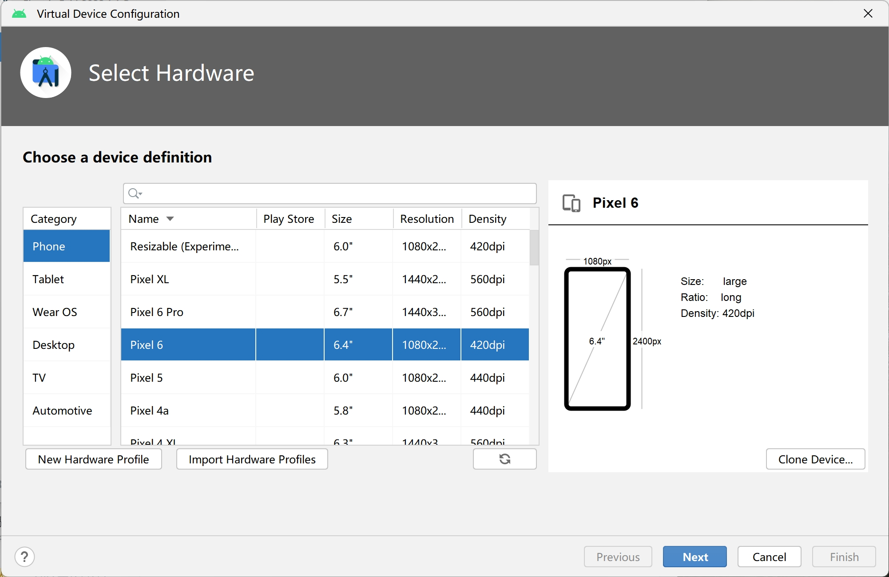
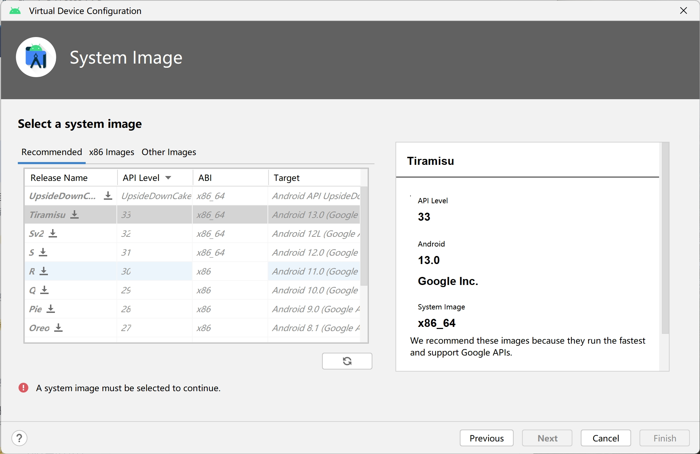
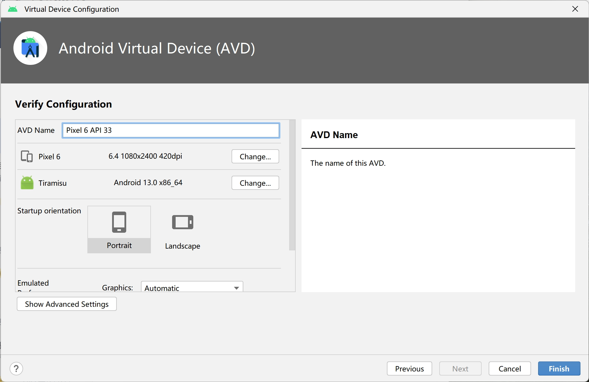

# Windows 创建 Android 模拟器

安装 Android Studio 并打开。

开始界面中间点击 More Actions > Virtual Device Manager：


点击左上角 Create device 创建一个新的设备：


我这里选择 Pixel 6：



系统选择镜像 Tiramisu 进行下载，镜像下载好之后选择 Finish 即可：




修改模拟器名称，点击 Finish 结束创建：



点击右侧的播放按钮即可打开模拟器：


{width=300}

```
$ flutter devices
4 connected devices:

sdk gphone64 x86 64 (mobile) • emulator-5554 ...
Windows (desktop)            • windows       ...
Chrome (web)                 • chrome        ...
Edge (web)                   • edge          ...
```

在工程文件夹中使用下面的命令运行项目：

```
$ flutter run -d emu
```

## References

- https://docs.flutter.dev/get-started/install/windows#android-setup
