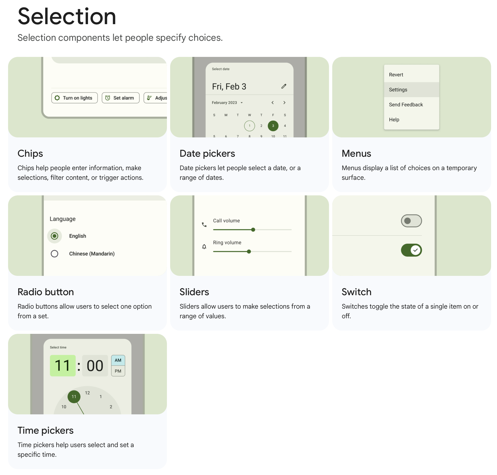
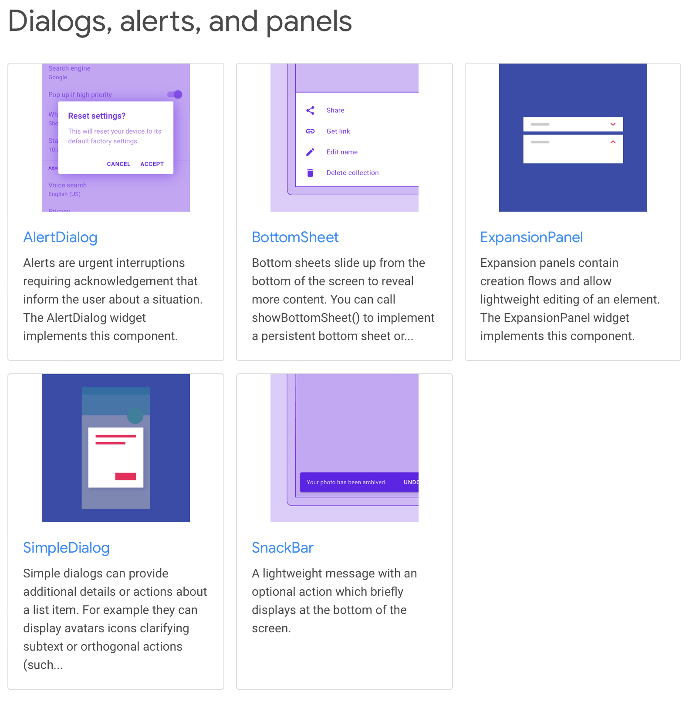
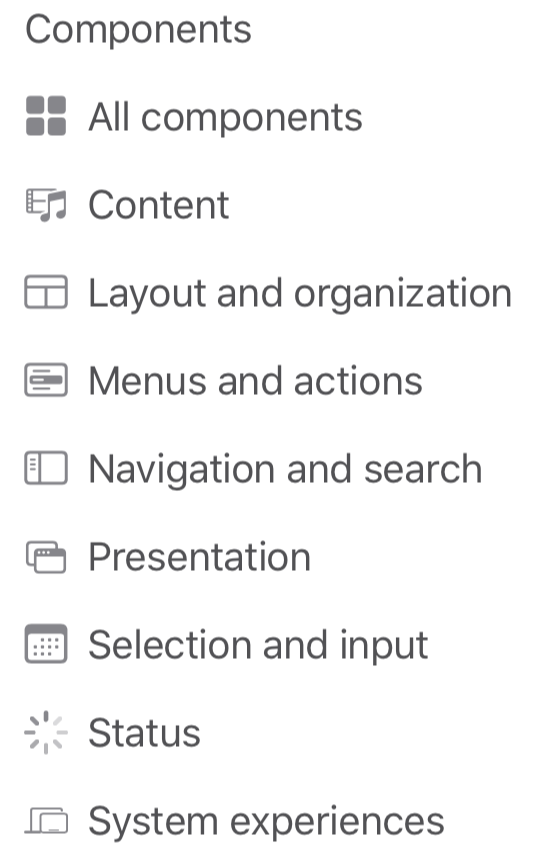
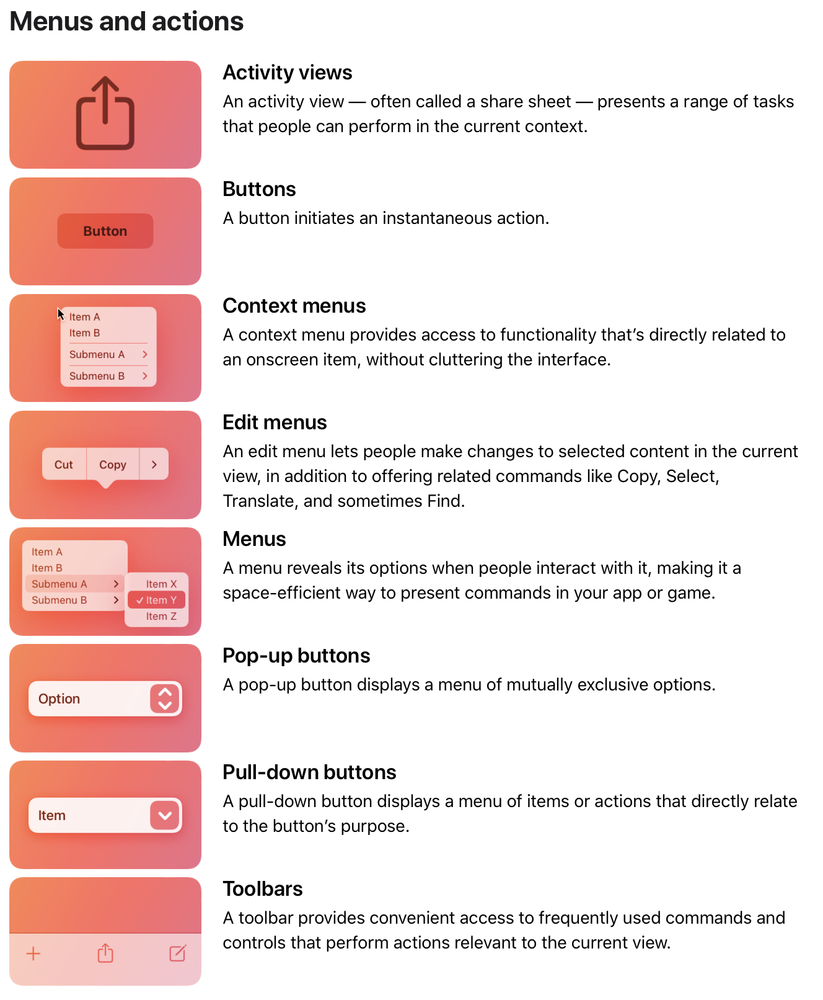
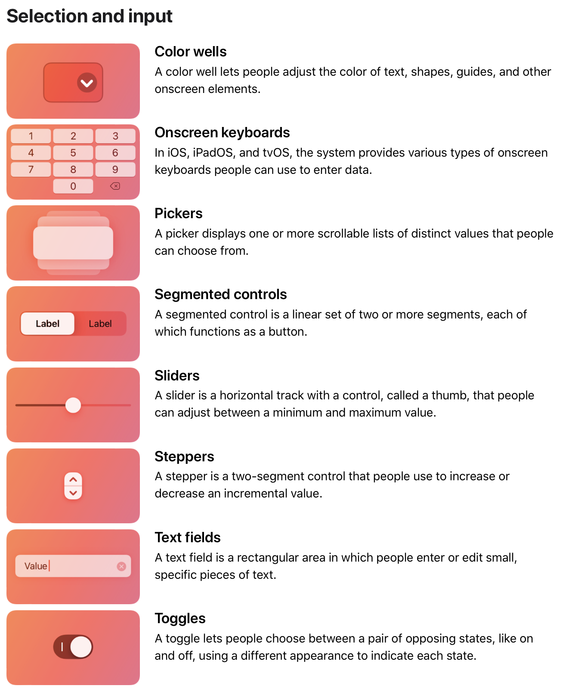
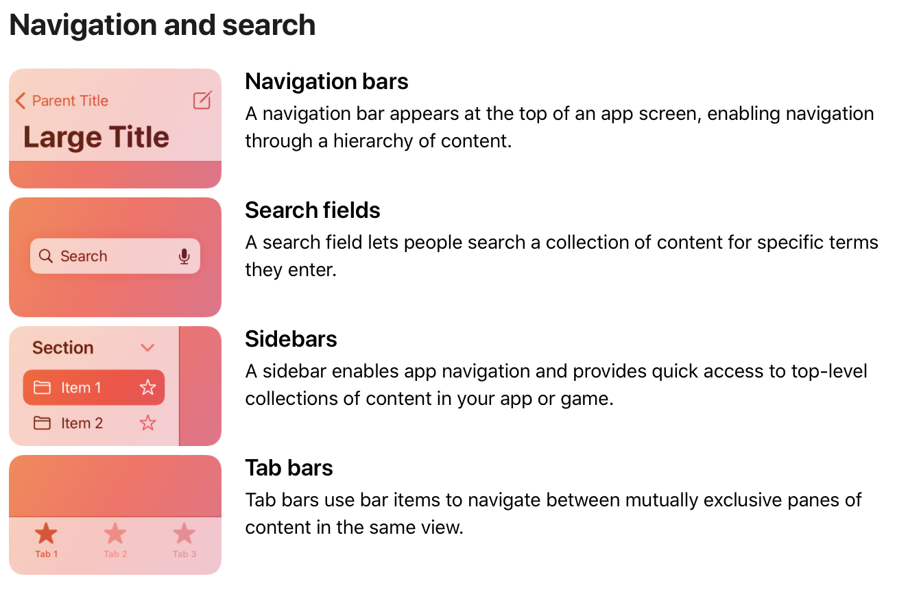

# 设计概览

## 应用开发团队分工

一般一款应用的诞生离不开下面的五个团队：

- 产品经理
    - 在初期分析市场需求、确定应用的目标群体、分析目标群体需求、确定应用的大致方向。
    - 规划应用的功能。
    - 管理项目进度。
- 设计团队
    - 确定应用中的数据结构。
    - 确定 UI（用户界面）和 UX（用户交互）设计稿件。
- 后端开发
    - 根据数据结构搭建应用后端。
- 前端开发
    - 根据 UI/UX 设计稿在目标平台用框架和代码构建应用。
- 运维团队
    - 在应用开发的全周期对代码质量进行管理。
    - 在应用发布之后关注用户反馈，提出应用可能需要更改的地方。

## 应用开发流程

下面所列出的大概是一款应用开发的流程：

### 应用选型

这一步主要是产品经理所做的事情。

#### 发现问题

一般当你想要开发一个软件的时候，你的考虑往往是**解决一个现实的问题**：

- 比如想和朋友实时聊天，然后微信就被开发出了
- 比如想和小伙伴交流问题，然后知乎就有了
- 比如有人觉得 C/C++ 虽然功能齐全，但相对老旧、代码编写起来很困难，于是各种现代编程语言就被设计出来

总之如果你想做有用的应用，你需要做到**问题导向**的——去解决什么问题，目标用户有哪些需求**，脑子里面带着问题去想**解决方案**，然后去设计应用。

很多时候，不要为了开发应用而去开发应用，而是面向问题来思考是否开发某个应用。可以头脑风暴一下自己身边有哪些**问题和机遇**——

- 看看自己生活中有哪些觉得不爽的地方
- 看看自己身边有哪些可以改进的地方
- 现在手机上的应用哪些还不够好用
- 有哪些应用可能在十年内会发光发热

其实你会发现 这不就是写论文的过程（调研）吗？看看别人做了什么，然后找找gap。调研的时候你可以头脑风暴、可以发问卷、可以调研同类的软件、可以看看相关的论文，更可以和相关的人聊一聊。信息收集的多了，你就知道哪些地方还有缺口，哪些地方还可以改进，这个就是gap。

当然**不要重复造轮子**，如果市面上已经有你想要的那种应用了，那就没太大必要重新自己实现一遍了；当然如果市场上的那种应用还不够好、或者说还没有完全抢占市场，那做一款类似的吸引目标用户也是一个选择。

#### 应用形式选择

- 使用方式
    - `命令行`
        - 如果面向的是熟知操作系统相关的用户，也许命令行程序就已经足够了，你可以减少对UI的考虑，多在内部逻辑功能上下功夫。
    - `图形界面`
        - 如果你想创建UI程序，也要注重你的目的：如果只是想给用户提供一个功能的使用接口，那其实做的简单一些也没有什么关系；如果是注重用户交互体验，那你的交互设计、动画、页面逻辑应该要下很大功夫
- 提供服务的方式：`本地计算` or `网络后端服务`
    - 大家可能知道服务即应用（SaaS），我这里想说的是：Linux后端服务为主还是应用在平台上的实现为主。比如你想做一个在线的棉花糖提问箱，网页后端写好，不论是浏览器还是本地应用，调用服务就可以搭建应用了，也许一个浏览器应用就足够了；但是如果你想做游戏，那可能本地构建还是更好一些。有些东西，能通过网络实现的话，其实没必要写平台（对应OS）的代码。如果希望跨平台，各种跨平台的框架也是可以考虑的。

#### 目标平台选择

**设备选择**：`手机`、`平板`、`电脑`（几种设备是很不一样的哦 我在之后会说到这一点）当然你可能要同时支持好几个

**系统选择**：

- `iOS` or `Android`？
- `iPadOS` or `Android`？
- `macOS` or `Windows` or `Linux`？
- 跨平台？浏览器？

一些区别在哪里呢？

- 比如你想开发游戏，有一说一用 Linux 应该会很辛苦，因为 Linux 平台用户较少、可能没有很好的游戏引擎、硬件的支持会弱一些。
- 如果要做商业软件，比如你要做机械设计软件、电路仿真软件，那大概率就选择 Windows 了，因为 Windows 的后向兼容承诺，你几十年不更新应用都没问题；macOS 并不承诺后向兼容就没有这么幸运了，而且苹果平台会不断让你给应用添加一些新的应用信息，总之就是你得不断更新你的应用，不然要么被下架、要么打开闪退。
- 跨平台的话，对于中小型软件来说我觉得是不错的选择，比如使用Flutter、React Native、Qt 这些框架，一份代码全平台部署。这里也有需要权衡的点，跨平台的框架和目标平台是否有着比较好的接口调用方式，是不是选择原生开发更好...

### 设计

对于咱们信息学院的工科同学来说，可能不是很看重应用的设计，但设计前置于开发，是一个应用的核心。

#### 什么是设计

Apple 公司为什么成功？是硬件软件的科技嘛？其实更多的是**设计**。很多人都说 Apple 算是全球数一数二的设计公司。好的设计让 Apple 把软硬件结合起来 实现了更人性化的系统。

回到现实中，盖楼、建房子的时候没有图纸怎么盖啊？第一步一定是画图纸。

一样的，没有设计方案，直接去写代码一定是空中楼阁。

**一般来说都是想好了再动手**。开始写完整的项目代码前最好已经有详细的数据结构、UI、UX设计，如果代码已经写的差不多了又开始改需求、改设计、改文档的话，代码是比较难调整的，甚至要重构很多部分。这时有同学就会问了，怎么可能在前期思考的时候面面俱到呢？是的，但至少要想个八九不离十，如果前期设计走了歪路，后面应用开发就很难开发好了。

#### 设计包含什么

不仅仅是界面 UI、交互 UX、还有你的数据结构 Data Structure、代码组织 Project Management，这些都是**设计**。

- 数据结构 Data Structure：应用基本上都是数据驱动的，你需要管理应用中的数据流。比如用表格列出了应用需要所有的数据类型，使用关系型数据库定义数据关系。
- 界面 UI：用户一眼看到的就是你的 UI，好的 UI 很容易给用户带来好的印象。一些显著的 UI 也可以帮助用户找到应用中比较核心的功能。
- 交互 UX：符合直觉的交互、或者简明的交互不至于让用户在你的应用中迷路。
- 代码组织 Project Management：基本上就是几个人如何合作的问题，因为开发应用很难是一个人的事情。在代码细节上，更多是哪些文件要放到哪些文件夹，项目到底有几份可执行文件，Git 使用的规范是怎样的……等等。这些都会影响实际的开发效率。如果组织的好，打开工程看到的就是清楚的思路和逻辑；组织的不好，想修一个 bug 半天都找不见要改的地方在哪里。

设计其实是一个整体规划，如果不知道从哪里下手，可以先看看官方的一些设计文档。下面我们也会讲到 Google 推出的一种设计规则 Material Design 和 Apple 提出的 Human Interface Guidelines。

#### 设计工具

- 思路
    - 草稿纸和铅笔 or iPad 和 Apple Pencil
    - 文本编辑器 备忘录
    - 在线文档
- 进一步整理思路
    - 思维导图软件：Xmind
    - 在线文档
- 设计文档
    - Markdown、Word 等格式化文本
    - 非常重要 有了设计文档 设计人员和开发人员才能一起合作
    - 包括但不限于 UI UX 数据结构 代码组织
- UI 设计 和 UX 设计
    - Figma
    - Adobe XD
    - Sketch
    - Powerpoint / Keynote

我们在后面主要希望教会大家使用 Figma 这一款 UI 设计工具。

### 开发

可以看到，开发并不是第一步。事实上，在实际的商业应用开发过程中，「开发程序员」所做的事情就是把「设计团队」做好的数据架构在服务器搭建部署、将 UI/UX 稿在对应的平台用代码实现出来。在大厂职务分的比较清楚的时候，「开发程序员」不会过多的参与到设计的部分。

再强调一遍：一般来说都是**想好了再动手**。开始写完整的项目代码前最好已经有详细的数据结构、UI、UX设计，如果代码已经写的差不多了又开始改需求、改设计、改文档的话，代码是比较难调整的，甚至要重构很多部分。这时有同学就会问了，怎么可能在前期思考的时候面面俱到呢？是的，但至少要想个八九不离十，如果前期设计走了歪路，后面应用开发怎么都开发不好了。尤其是在团队合作的时候，一定要把思想落实下来到纸上，否则别人可理解不了你自己在想什么。

在开发阶段，开发框架的选择应该是第一步。要开发安卓的应用，你需要考虑是使用安卓原生的框架、Jetpack 的 Compose、还是 Flutter。要开发 iOS 应用，你需要考虑是使用 UIKit、还是 SwiftUI、还是 Flutter。网页端前端的选择如 React、Vue 都比较流行。如果是桌面端应用，也是各种框架可以选。当你的应用不局限于单一平台的时候，你可能还会去比较各种跨平台框架，比如 Flutter、ReactNative、Qt、Unity。

后端的框架就更多了，这里也不过多讲解。

课程选用的开发框架是 Flutter，Flutter 最开始专注于 Android 和 iOS 两平台同一份代码库的应用开发，之后逐渐扩展支持了全平台。除了框架的使用本身比较简洁明晰有很多优点意外，Flutter 也原生支持了 Material Design 和 Human Interface Guidelines 这两种设计准则的组件，几行代码就可以直接调用。

一个实际应用的开发都是以团队为单位，这就对源代码的更新和管理提出了比较高的要求。

应用开发的过程中也会有测试的环节，对代码逻辑进行测试、对 UI 是否工作进行测试，当然也有人工测试。这个过程中自动化也是很重要的一个点，每次提交代码之后代码管理平台自动进行测试保证应用正常运行，这也是 CI（continues integration 持续集成）很重要的一点。

### 发布

当应用差不多实现之前设计的功能，达到预期时，就需要发布了；这时的版本号一般都是 `v1.0.0`。不同平台的发布渠道比较多，比如安卓有 Google Play Store、各大手机厂商的应用商店、网页端直接下载 APK；iOS 则有 App Store、TestFlight（内部使用、内测、公测）。

### 维护和迭代

发布之后，应用也需要随着使用不断添加新功能、或者之前的一些问题被发现、从用户那边也会收到很多反馈，要对项目进行不断的维护和迭代。

当后续发版不断变多，自动化的思想也需要被添加进来，这也就是常说的 CD（continues delivery 持续交付）。比如每次修改了 Git 仓库主分支的标签时，应用自动被构建，得到的各平台安装包分别推送到各平台的应用商店供用户下载。

## 设计准则

接下来我们介绍两种设计准则：Google 推出的 Material Design 和 Apple 推出的 Human Interface Guidelines。

我们经常说，不要重复造轮子。这一点在代码开发上一定成立、在设计上一样成立。这两种主流的设计规范阐释了很多应用开发需要注意的点，对应提出了经验性的解决方案，和目标平台的习惯也很相近。同时，结合这两种设计准则的设计套件和开发框架也非常易用，在自己设计开发的应用定制化需求并不强时，优先考虑这两种设计准则是很好的。

个人非常推荐在入门应用设计开发前，通读一两遍 Material Design 或者 Human Interface Guidelines，这能让你在设计开发应用时有一些范式可以参考，从而获得更高效的设计开发速度，应用的用户体验也会更好。

## Material Design

官网：<https://m3.material.io>

> What's Material?
> 
> Material Design is a design system built and supported by Google designers and developers. Material.io includes in-depth UX guidance and UI component implementations for Android, Flutter, and the Web. 
>
> The latest version, Material 3, enables personal, adaptive, and expressive experiences – from dynamic color and enhanced accessibility, to foundations for large screen layouts and design tokens.
> 
> <https://m3.material.io/get-started>

### 准则

打开 <https://m3.material.io/foundations>，我们可以看到下面的一些话题：

- Accessibility: 让更多人满足的设计
- Adaptive design: 针对不同设备做不同的适配
- Cutomizing Material: 应用基于 Material Design 的个性化
- Interaction states: 交互时的状态
- Design Tokens: Material Design 使用的一些一些名词

在 <https://m3.material.io/styles> 中也有很多关于设计的内容：

- Color
- Elavation
- Icons
- Motion
- Shape
- Typography

这些页面中都有很多关于 Material Design 的介绍、使用。比如从 Interaction states 和 Elavation 你会了解到 Material Design 比较核心的概念是「抬升 Elavation」，结合「状态层 state layers」呈现出动画。

这部分内容对于专门学设计的同学可能很熟悉。非设计专业的同学只需要简单了解就可以了。

### 组件

对于开发来说，使用组件能够极大加快开发速度。举个例子，输入框：其实从零实现一个输入框是非常复杂的事情，首先你需要接收用户输入、这牵扯到键盘事件的监听，其次你需要显示用户输入的内容，需要考虑输入内容的长度、是否为密码、数据是否有效等，当然还要考虑光标的移动、组件的动画、多平台的适配等等。

但如果使用 Material Design 与 Flutter 开发框架，你只需要把 TextField 这个 Widget 放到代码中，填入你需要的参数就可以了。可以说，这一些常用的、通用的组件极大的简化了应用设计和开发。

Material Design 中的组件主要分为六种：

- Actions: 可点击的交互组件
- Text inputs: 用户编辑文字的组件
- Selection: 提供选项供用户选择的组件
- Communication: 显示应用当前状态的组件
- Containment: 存放信息或小组件的框架
- Navigation: 承载各个页面和页面之间关系的框架

### 设计文件

之前提到，开发之前是设计，如果要使用 Material Design，那么设计稿里面当然也要有 Material Design 的风格、主题和组件。Google 提供了 Figma 的 Design Kit，我们可以打开 <https://www.figma.com/community/file/1035203688168086460> 点击右上角的 Get a Copy 将这份文件存到自己 Figma 账户下使用。

### 开发

打开 <https://m3.material.io/develop> 可以看到 Material Design 在 MDC-Android（安卓原生开发（应该是））、Jetpack Compose 和 Flutter 这三个框架中得到了支持（Web 端的支持在计划中）。这意味着，在这三个框架中，你可以用少量代码快速应用 Material Design，让你的应用整体看起来统一舒适。

在 <https://docs.flutter.dev/development/ui/widgets/material> 可以快速找到 Flutter 中 Material Design 的组件。在 <https://docs.flutter.dev/cookbook> 的 Design 部分也有这在 Flutter 中使用 Material Design 的一些说明。

### 应用质量评估

这部分不全是 Material Design 提供的准则，也有 Google 对于 Android 平台提出的一些要求。在设计应用和优化迭代时查看准则，提高应用的质量，让应用能够触及更多人。

- 核心的应用质量 <https://developer.android.com/docs/quality-guidelines/core-app-quality>
- 让应用被更多人使用 <https://developer.android.com/docs/quality-guidelines/build-for-billions>
- 大屏安卓设备 <https://developer.android.com/docs/quality-guidelines/large-screen-app-quality>
- 游戏 <https://developers.google.com/games/services/checklist>

## Human Interface Guidelines

官网：<https://developer.apple.com/design/human-interface-guidelines/guidelines/overview/>

Human Interface Guidelines (HIG) 是 Apple 为自家的所有平台的应用设计提出的指导，里面涵盖的内容比 Material Design 要更丰富一些。但是无所谓设计准则熟优孰劣，各有特色。

如果你有苹果设备，你也可以在 App Store 下载 Developer，其中主要内容是开发相关，也有不少设计相关的内容，形式是视频和文章。

### 平台特色

Apple 有着软硬件融合的 iOS、iPadOS、macOS、tvOS、watchOS 平台，Apple 更了解各个平台的异同。在 HIG 的 Platforms 中，Apple 描述了各个平台应用开发需要注意的事项，给出了很多建议（best practices）。

下面是简单总结的一些平台特色：

**电脑**

- Flexible
    - 窗口大小可调整
    - 一个操作可以从右键、菜单栏、工具栏等多种方法调出
- Expansive
    - 一般电脑的屏幕是很大的 有时还会外接显示器
    - 全屏模式适配
- Capable
    - 一个小的操作背后是专业的处理
- Focused
    - 电脑是生产力工具 设计UI时需要考虑让用户保持专注

**手机**

- themes
    - Clarity
        - 凸显重要内容
    - Deference
        - 动画呈现页面、元素间的逻辑
    - Depth
        - 用深度呈现层级（注：Material Design 强调的是 Elavation）
- principles
    - Aesthetic Integrity
        - 有冲击力
    - Consistency
        - 应用内组件交互呈现一致性
        - 尽量与系统的组件和交互一致
    - Direct Manipulation
        - 即时处理用户的输入
    - Feedback
        - 动画
    - Metaphors
        - 与真实世界物理形成类比
    - User Control
        - 给用户足够的指引和说明

**平板**

> Discover the building blocks for designing a great iPad app: Learn how to **minimize use of modal interfaces** and leverage the **new sidebar** to increase efficiency by streamlining navigation and facilitating powerful drag and drop interactions. See how to take advantage of iPad's versatile interaction opportunities by **supporting multitouch, pencil, keyboard, and trackpad**. And create adaptive layouts that respond to all size classes and orientation to support a great **multitasking experience**. These techniques will not only improve your iPad app - they'll make it easier to create a Mac Catalyst app that truly feels right at home on macOS. -- [WWDC20 | Designed for iPad](https://developer.apple.com/wwdc20/10206)

WWDC 是每年六月 Apple 准备的全球开发者大会，每年都会发布一些开发和设计上的新引导。在 WWDC20 上，iPadOS 端的交互得到了比较多的更新，集中体现在上面的这个视频中了。最早的 iPadOS 其实就是 iOS，交互方式和组件与手机端操作差不多。但是逐渐 Apple 想让 iPad 承载用户更多的期待，于是 iPadOS 端逐渐更新，变的与 iOS 不同。

- minimize use of modal interfaces: 让一个小的 Alert 放到大屏 iPad 的最中间而阻碍其他空间很奇怪，应该尽量少使用遮挡全屏幕的模态窗口。
- new sidebar: 之前 iPadOS 的导航主要用的是屏幕下方的 Tabs，但是存在大屏很难点击的问题。现在新的 Sidebar 将导航内容放到左侧，这成为了 iPad 的一种新的导航方式。
- supporting multitouch, pencil, keyboard, and trackpad: iPadOS 的交互方式很多，像多点触控、Apple Pencil，甚至还可以接入键盘和触控板。应用需要对这些输入进行适配来让用户获得更好的体验。
- multitasking experience: 多任务，也就是在 iPadOS 上引入的多窗口，这要求应用支持各种动态的比例和尺寸。
- ...

### 设计基础

可以看到这部分基本上是纯设计。总结几点：

- 应用上架的时候一定要准备一个好看简洁能令用户印象深刻应用图标。
- 想让应用接触更多用户，考虑 Accessibility 和 Inclusion 中的内容。
- SF Symbols 是 Apple 设计的图标库，涵盖了绝大多数常用的图标。

### 交互模式

交互方式里面说的挺全面的，基本上将很多 UX 都总结了出来。

#### 输入方式

这里列举了一些输入用的硬件设备。Apple 平台独特的输入方式应该有两个，一个是 macOS 端的触控板、另一个是 iPadOS 端的 Apple Pencil。在开发这两个平台的应用的时候可以注意对这两种输入方式的适配。

### 界面组件

注：筛选 iOS and iPadOS

- Menus and actions: 可点击的交互组件（Material Design - Actions）
- Selection and input: 用户选择和输入（Material Design - Text inputs、Selection）
- Content: 内容呈现
- Status: 状态呈现（Material Design - Communication）
- Presentation: 存放信息或小组件的框架（Material Design - Containment）
- Layout and organization: （Material Design - Navigation、Communication）
- Navigation and search: 承载各个页面和页面之间关系的框架（Material Design - Navigation）
- System experiences: 与系统相关的组件

组件具体有如下的多种：

### 技术

可以看到，Apple 的 HIG 还提供了很多「科技」，Apple 认为这也是应用功能设计的一部分。Apple 同时为这些「科技」提供了可以调用的 API 或 SDK 为开发者提供便利。

## Figma 入门

[Figma](https://www.figma.com) 是一款非常容易上手的在线多人协作设计工具。下面我们简单讲一些 Figma 最基础的操作，更多的进阶操作大家在之后有使用 Figma 的需求时跟着一个项目做，很快就可以了解更多内容了。

### 基础元素

做不管多么华丽的设计，大多数时候都是由最基础的元素组合而成的。Figma 中有下面的一些基础元素：

- 矩形 Rectangle
- 直线 Line
- 圆形 Ellipse
- 文字
- 矢量图
- 像素图

在左上角工具栏找到对应的元素点击，再在中间的画布上点击就可以添加一个基础元素。移动位置进行组合就可以画出简单的用户界面。对于图标，可以直接复制粘贴至 Figma。

不同的元素会在左侧的边栏显示，双击可以修改元素的名称。点击元素在右侧可以做一些设置。

提示：只使用 Figma 自带的元素很难创建出比较好看的用户界面，一般设计团队会基于一些比较底层的设计库来做，比如下方提到的 Material Design。

### 使用 Material Design 模板文件

如果你的团队希望使用 Material Design 进行设计和开发，你可以直接使用 [Material 3 Design Kit](https://www.figma.com/community/file/1035203688168086460)，打开之后点击右上角的 Get a copy，即可将这份 Figma 文稿复制一份到你的账户下。之后要使用什么 Material Design 的组件，直接从中复制粘贴到项目的设计稿即可。关于 Material 3 Design Kit 的更多信息，你可以查看 [Introducing the M3 design kit for Figma](https://material.io/blog/material-3-figma-design-kit)。

### 成组

一个组件可能由多个小元素组合而成。在左侧选中多个元素，右键使用「成组（Group selection）」将它们放在一个文件夹里面。当设计文稿越来越大时，这会让你的项目变得非常有条理。

### 层级

在做设计的时候，我们比较关注层（layer）。层默认是透明的，多层堆叠组成一个页面（page）。

在 Figma 中，你可以在左侧的边栏上下挪动元素的位置来调整覆盖关系，上方的元素覆盖下方的元素。

### 组件

在设计的过程中，有一些元素是重复的，比如列表视图中的分割线，比如每一页都要使用的应用导航栏。这时用复制粘贴存在一个问题，粘贴后的内容如果要修改，那就要把所有的元素挨个修改。

在 Figma 中，对于重复利用的元素，我们可以创建一个组件（component）。选中元素，在网页最上方有一个四个实心菱形组成的图标，点击即可创建组件。复制粘贴后的组件，会与原来的组件保持关联。原组件被修改，所有复制粘贴出来的组件都会被统一修改。

### 导出

设计稿需要导出给开发人员，开发人员根据设计稿来用代码实现用户界面。

最简单的导出方式是，直接把 Figma 文稿链接发给小伙伴，或者在 Figma 中直接共享给对应的用户。如果对方不方便登录在线的 Figma，你也可以选中需要导出的内容，在右下方 Export 处点击加号，选择资源倍率和格式，点击 Export 即可。

### 多人合作

上面所说的功能，只要是一款 2D 设计软件，基本上都有相应的功能。Figma 独有的功能，属多人的协同最突出。

当你和团队中的小伙伴一起看一份设计稿的时候，网页会以不同颜色的框标注出不同人正在查看的位置，你可以点击右上角小伙伴的头像来跟踪 ta 的当前位置。不仅是查看，修改也是同步的，一个小团队在一份设计稿上工作是完全没有问题的。用好了这一个功能，团队协作效率大大提升。
