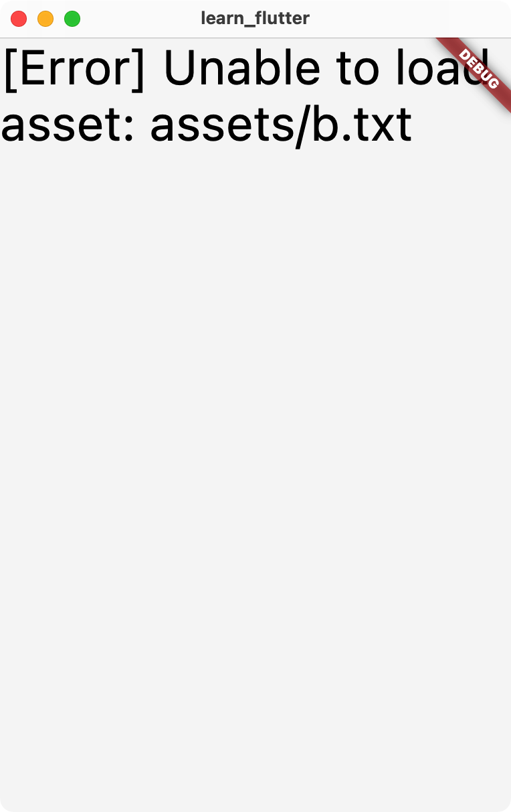

# 添加 Assets

Flutter 应用可以包含代码和资源，资源主要包括静态数据、配置文件、图标、图片、音乐等。

在 Flutter 中添加和使用资源的步骤如下：

1. 在项目文件夹中添加资源
    - 例如在项目文件夹中新建 assets 文件夹（也可以取其他名字），在文件夹中添加 a.txt
2. 在 pubspec.yaml 中添加资源路径或资源文件夹路径
    - flutter > assets 处添加路径，如 assets/a.txt
3. 在代码中使用资源
    - （推荐）在 Widget 中，可以用 `DefaultAssetBundle.of(context).load("assets/a.txt")` 获取到 Flutter 构建得到的资源包。
    - 在 Widget 外，需要使用 `import 'package:flutter/services.dart' show rootBundle;` 和 `rootBundle.loadString(("assets/a.txt")` 获取。

## 实例：文字

在项目文件夹添加 `assets/a.txt`，内容为 `Hello, world!`。在 `pubspec.yaml` 中添加 `assets/a.txt`。新建 Flutter 项目运行下面的应用：

```dart
import 'package:flutter/material.dart';
import 'package:flutter/services.dart' show rootBundle;

void main() {
  runApp(const MyApp());
}

class MyApp extends StatelessWidget {
  const MyApp({super.key});

  @override
  Widget build(BuildContext context) {
    return const MaterialApp(
      home: DefaultTextStyle(
          style: TextStyle(
              decoration: TextDecoration.none,
              color: Colors.black,
              fontSize: 36),
          child: MyTextWidget()),
    );
  }
}

class MyTextWidget extends StatefulWidget {
  const MyTextWidget({super.key});

  @override
  State<MyTextWidget> createState() => _MyTextWidgetState();
}

class _MyTextWidgetState extends State<MyTextWidget> {
  final Future<String> text = rootBundle.loadString("assets/a.txt");
  // final Future<String> text = rootBundle.loadString("assets/b.txt");

  @override
  Widget build(BuildContext context) {
    return FutureBuilder(
        future: text,
        builder: ((BuildContext context, AsyncSnapshot<String> snapshot) {
          if (snapshot.hasData) {
            return Text(
              "[OK] ${snapshot.data!}",
            );
          } else if (snapshot.hasError) {
            return Text("[Error] ${snapshot.error.toString()}");
          } else {
            return const Text(
              "[Loading...]",
            );
          }
        }));
  }
}
```

- 使用 `final Future<String> text = rootBundle.loadString("assets/a.txt");` 拿到 `Future<String> text`，进一步作为 `StatefulWidget` `MyTextWidget` 的状态，构建时使用 `FutureBuilder` 来对 `text` 做判断从而在界面显示。

显示效果如下：


将 `a.txt` 修改为不存在的 `b.txt`，结果如下：



## 实例：图片

我们可以和上面的例子一样，使用 `rootBundle.load("a.png")` 来加载二进制文件，进一步使用 `Image` Widget 来显示。但是，图片的读取解码处理和显示远比文字要复杂，Flutter 提供了一种更方便的方式来家在和显示图片：

```dart
Image(image: AssetImage('assets/a.png'))
```

## 使用包来管理资源

你可以将资源打包发布为一个 Dart 第三方包，方便在多个项目中使用。具体可以参考 <https://docs.flutter.dev/development/ui/assets-and-images#from-packages>。

## References

- https://docs.flutter.dev/development/ui/assets-and-images
- https://stackoverflow.com/questions/47114639/yellow-lines-under-text-widgets-in-flutter
- https://api.flutter.dev/flutter/widgets/FutureBuilder-class.html
- 