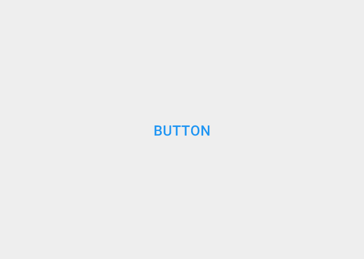
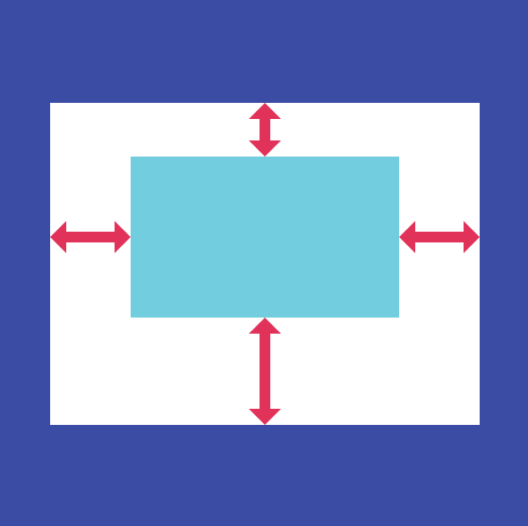
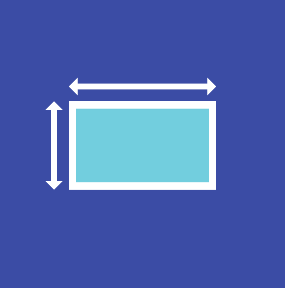
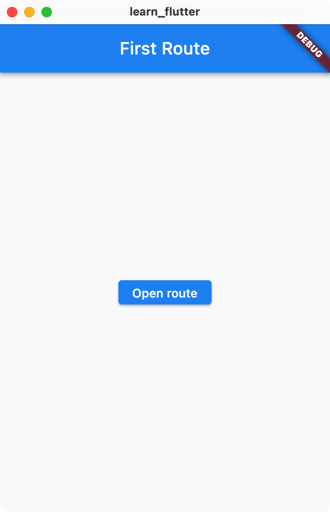

# Widgets

这节课我们会先了解 Flutter 应用的简单结构，然后介绍一些常用的用户界面组件以及一些常用的控制组件。下节课我们会说明 Flutter 中的两种 Widget 的区别与联系，重点讲述状态管理。

## 最简单的 Flutter 应用

Flutter 一个很重要的思想就是组合。在应用开发的设计过程中，我们也会先设计小的组件，然后将小的组件成组，逐渐堆叠组合形成完整的用户界面；可以说，组合这种思想是很适合现代应用开发的。具体来说，Flutter 中的所有组件都是 Flutter，包括 UI、手势控制、布局...这些都是 Widget，一个 Flutter 应用就由多个 Widgets 组成。

下面是一个最简单的 Flutter 应用：

```dart
import 'package:flutter/material.dart';

void main() {
  runApp(
    const Center(
      child: Text(
        "Hello, world!",
        style: TextStyle(fontSize: 48, color: Colors.black),
        textDirection: TextDirection.ltr,
      ),
    ),
  );
}
```

- Flutter 中的所有元素基本上都是 Widget，可以使用 `import 'package:flutter/widgets.dart';` 来导入常用的 Widgets，或者使用 `import 'package:flutter/material.dart';` 来导入包括 Material Design 的更多常用 Widgets。
    - `Text` 是一个 Widget，用于显示文字。这里 `Text(...)` 的语法是在初始化 `Text` 这个类的实例。第一个参数是要显示的文字，后面的参数不添加则使用默认值。可以看到这里制定了文字的样式和方向，如果不指定方向会报错，因为没有默认的文字方向；不指定样式为黑色可能默认为白色看不到。
    - `Center` 也是一个 Widget，但它的作用不是显示什么东西，而是将它的 child 居中。可以看到 Widget 也可以用于布局（指定相对位置）。
    - 这样的层级关系体现出了声明式的特点，开发者可以比较容易的看到界面的层级关系。
- `runApp()` 接收一个 Widget 作为参数，将这个 Widget 铺满屏幕。最终的效果是，`Center` 这个 Widget 铺满了屏幕，并且将它的子 Widget 放到了最中间。

编写 Flutter 代码，最基础的事情就是「组合」。你需要使用最基础的 Widget 来实现整个应用的界面和功能。

## StatelessWidget

编写一个 Flutter 应用，我们主要会使用 `StatelessWidget` 和 `StatefulWidget`。Widget 有着自己的状态时选择 `StatefulWidget`（下节课介绍），否则选择 `StatelessWidget`。`StatelessWidget` 最大的作用是封装成组，例如下面的例子：

> 提示：在 VS Code 中敲 `stl` 即可自动补全 `StatelessWidget`。

```dart
import 'package:flutter/material.dart';

void main() {
  runApp(const MyApp(text: "Hello, world!"));
}

class MyApp extends StatelessWidget {
  final String text;

  const MyApp({super.key, required this.text});

  @override
  Widget build(BuildContext context) {
    return Center(
      child: Text(
        text,
        style: const TextStyle(fontSize: 48, color: Colors.black),
        textDirection: TextDirection.ltr,
      ),
    );
  }
}
```

我们进一步将刚刚居中的文字变成了一个 `StatelessWidget`，并且添加了一个参数 `text`，这样这个 Widget 有了可复用性，同时也让代码整体看起来更清晰。

一个 Widget 主要的功能体现在 `build()` 中，这个函数描述该组件如何组合更底层的组件从而构建自己。

`context`（类型 `BuildContext`） 在各个 Widgets 的层级结构中传递着一些参数，比如当前的显示状态、默认文字样式等等，有一点类似于全局变量。我们之后会用到。

## MaterialApp

Flutter 主要使用的设计语言是 Material Design，里面包含动画、主题、很多便捷的 UI/UX 组件，我们在第二节课已经介绍过。这一节课我们主要聚焦于如何在 Flutter 中使用 Material Design。

Material Design 在 Flutter 中最关键的两个 Widget 是 `MaterialApp` 和 `Scaffold`。

- `MaterialApp` 是一个最顶层的 Widget，如果你希望你的应用使用 Material Design，最好在 `runApp()` 中传入 `MaterialApp`。
    - 与 `MaterialApp` 类似，还有使用了 Human Interface Guidelines 设计的 `CupertinoApp` 用来向 iOS 用户提供与系统应用类似的体验。课程只关注 Material Design。
- `Scaffold` 可以直观理解为应用的一页，但更准确的理解是其可以为 Material 组件提供一个动画层，进一步呈现各种动画效果。

下面的这个例子使用了一些 Material Design 的基础组件：

```dart
import 'package:flutter/material.dart';

void main() {
  runApp(MyApp());
}

class MyApp extends StatelessWidget {
  const MyApp({super.key});

  @override
  Widget build(BuildContext context) {
    return MaterialApp(
      title: "Learn Flutter",
      home: MyScaffold(),
    );
  }
}

class MyScaffold extends StatelessWidget {
  const MyScaffold({super.key});

  @override
  Widget build(BuildContext context) {
    return Scaffold(
      body: MyWidget(),
      appBar: AppBar(title: Text("DEMO")),
      floatingActionButton: FloatingActionButton(
        onPressed: () {
          debugPrint("clicked");
          ScaffoldMessenger.of(context).showSnackBar(SnackBar(
            content: Text("clicked"),
          ));
        },
        child: Icon(Icons.ads_click),
      ),
    );
  }
}

class MyWidget extends StatelessWidget {
  const MyWidget({super.key});

  @override
  Widget build(BuildContext context) {
    return Center(child: Text("Hello, world!", style: TextStyle(fontSize: 48)));
  }
}
```

- 从应用结构上来说，使用 `MaterialApp` 包含一个 `Scaffold`，很容易看出这是一个单页的应用，结构更加清楚。
- 在 `Scaffold` 中添加了 `AppBar` 和 `floatingActionButton`，运行应用可以看到界面和较多现有应用保持一致，这有助于给用户带来熟悉感。
- 在动画效果上，`floatingActionButton` 和 `SnackBar` 的动画效果添加让界面看起来更流畅。
- 可以看到，在使用 `Text` 这个 Widget 时，我们不需要再指定文字方向和字体颜色了，这是因为 `MaterialApp` 中包含一些通过 `context` 传递的参数，相当于一个默认值。

注意，使用 Flutter 框架不意味着必须要使用 Material Design，因为 Flutter 本身已经提供了足够多的基础组件，但使用 Material Design 会省去很多麻烦，极大提高开发应用的效率。在后续的学习过程中，我们也不区分 Flutter 原生的组件与 Material Design 的组件。

### 设置项

`MaterialApp` 中也有一些可以配置的项，比如：设置主题（`theme`）、应用的地域（`locale`）；一些与调试相关的选项：`debugShowCheckedModeBanner` 是否显示右上角的调试按钮、`debugShowMaterialGrid` 显示网格、`showSemanticsDebugger` 调试。

## 常用展示组件

### 嵌入式

- [Icon](https://api.flutter.dev/flutter/widgets/Icon-class.html)
    - 显示图标
- [Text](https://api.flutter.dev/flutter/widgets/Text-class.html)
    - 显示纯文本
    - [DefaultTextStyle](https://api.flutter.dev/flutter/widgets/DefaultTextStyle-class.html)
        - 设置默认的文字样式。在使用 `MaterialApp` 时不推荐使用，因为 `MaterialApp` 有默认样式，通过主题来修改是更好的选择。
    - [RichText](https://api.flutter.dev/flutter/widgets/RichText-class.html)
        - 显示富文本。
- [Image](https://api.flutter.dev/flutter/widgets/Image-class.html)
    - 显示图片
- [Placeholder](https://api.flutter.dev/flutter/widgets/Placeholder-class.html)
    - 在开发中临时占位代表未添加的组件。

#### Icon

一种图标是 Flutter 框架自带的 Material Design 图标，在 [Icons 文档](https://api.flutter.dev/flutter/material/Icons-class.html) 中可以查看全部的图标。使用方法：

```dart
Icon(Icons.close)
```

另一种比较推荐的是 Human Interface Guidelines 中的图标，在 [CupertinoIcons 文档](https://api.flutter.dev/flutter/cupertino/CupertinoIcons-class.html) 中可以查看全部的图标。在 `pubspec.yaml` 的 `dependecies` 中添加 `cupertino_icons`。用法如下：

```dart
import 'package:cupertino_icons/cupertino_icons.dart';

Icon(CupertinoIcons.multiply)
```

图标有着非常简洁却又有着很高的表现力，非常推荐大家在寻找组件时优先在上面两个官方支持的图标库中挑选。

#### Text

```dart
Text(
  "Hello, world!",
  style: TextStyle(fontSize: 48),
)
```

```dart
Text(
  "Hello, world!",
  style: Theme.of(context).textTheme.titleLarge,
)
```

更推荐使用 `textTheme` 来获取当前环境中 Material Design 约定的字体大小，这有助于使得应用整体结构清晰。

也可以在偏上层的位置包裹 [`DefaultTextStyle`](https://api.flutter.dev/flutter/widgets/DefaultTextStyle-class.html) 这个 Widget 来对默认样式进行覆盖。

##### size

Flutter 使用的 size 都是 logical pixels，与实际在屏幕上显示的像素数的倍数关系用 `devicePixelRatio` 表示。使用 `debugPrint("${MediaQuery.of(context).devicePixelRatio}");` 可以呈现当前设备的 `devicePixelRatio`。

可以查看 [widgets/MediaQueryData/devicePixelRatio](https://api.flutter.dev/flutter/widgets/MediaQueryData/devicePixelRatio.html) 和 [dart-ui/FlutterView/devicePixelRatio](https://api.flutter.dev/flutter/dart-ui/FlutterView/devicePixelRatio.html) 获取更多信息。

#### Image

在项目中使用图片，最简单的方法是在项目文件夹中添加资源，然后在代码中使用。具体方法可以参考 [添加 Assets](./assets.md)。

还有一种方式是通过网络获取图片并显示，如：

```dart
Image.network('https://example.com/a.png')
```

如果是需要下载存储到应用中的图片，那么需要结合目标平台的文件系统，这种使用方法可以参考第六讲的本地持久存储。

### 弹出式

- [SnackBar](https://api.flutter.dev/flutter/material/SnackBar-class.html)
    - 在屏幕下方呈现的简短信息条，可以添加一些辅助按钮
- [BottomSheet](https://api.flutter.dev/flutter/material/BottomSheet-class.html)
    - 在屏幕下方呈现多个操作栏目
- [AlertDialog](https://api.flutter.dev/flutter/material/AlertDialog-class.html)
    - 在屏幕中间呈现的警告，让用户确认或取消其操作
- [SimpleDialog](https://api.flutter.dev/flutter/material/SimpleDialog-class.html)
    - 用于解释或提供一个用户输入的界面

#### SnackBar


```dart
import 'package:flutter/material.dart';

void main() {
  runApp(MaterialApp(
      home: Scaffold(
    body: BodyWidget(),
  )));
}

class BodyWidget extends StatelessWidget {
  BodyWidget({super.key});

  @override
  Widget build(BuildContext context) {
    return GestureDetector(
      onTap: () {
        ScaffoldMessenger.of(context)
            .showSnackBar(SnackBar(content: Text("Hello, world!")));
      },
    );
  }
}
```

#### BottomSheet


```dart
import 'package:flutter/material.dart';

void main() {
  runApp(MaterialApp(
      home: Scaffold(
    body: BodyWidget(),
  )));
}

class BodyWidget extends StatelessWidget {
  const BodyWidget({super.key});

  @override
  Widget build(BuildContext context) {
    return Center(
      child: ElevatedButton(
        child: const Text('showBottomSheet'),
        onPressed: () {
          Scaffold.of(context).showBottomSheet<void>(
            (BuildContext context) {
              return Container(
                height: 200,
                color: Colors.amber,
                child: Center(
                  child: Column(
                    mainAxisAlignment: MainAxisAlignment.center,
                    mainAxisSize: MainAxisSize.min,
                    children: <Widget>[
                      const Text('BottomSheet'),
                      ElevatedButton(
                        child: const Text('Close BottomSheet'),
                        onPressed: () {
                          Navigator.pop(context);
                        },
                      ),
                    ],
                  ),
                ),
              );
            },
          );
        },
      ),
    );
  }
}
```


#### AlertDialog


```dart
import 'package:flutter/material.dart';

void main() {
  runApp(MaterialApp(
      home: Scaffold(
    body: BodyWidget(),
  )));
}

class BodyWidget extends StatelessWidget {
  BodyWidget({super.key});

  @override
  Widget build(BuildContext context) {
    return GestureDetector(
      onTap: () {
        showDialog<void>(
          context: context,
          barrierDismissible: false, // user must tap button!
          builder: (BuildContext context) {
            return AlertDialog(
              title: const Text('AlertDialog Title'),
              content: SingleChildScrollView(
                child: Text('AlertDialog Demo'),
              ),
              actions: <Widget>[
                TextButton(
                  child: const Text('Cancle'),
                  onPressed: () {
                    Navigator.of(context).pop();
                  },
                ),
                TextButton(
                  child: const Text('OK'),
                  onPressed: () {
                    Navigator.of(context).pop();
                  },
                )
              ],
            );
          },
        );
      },
    );
  }
}
```

#### SimpleDialog


```dart
import 'package:flutter/material.dart';

void main() {
  runApp(MaterialApp(
      home: Scaffold(
    body: BodyWidget(),
  )));
}

class BodyWidget extends StatelessWidget {
  const BodyWidget({super.key});

  @override
  Widget build(BuildContext context) {
    return Center(
      child: OutlinedButton(
        onPressed: () => _dialogBuilder(context),
        child: const Text('Open Dialog'),
      ),
    );
  }

  Future<void> _dialogBuilder(BuildContext context) {
    return showDialog<void>(
      context: context,
      builder: (BuildContext context) {
        return SimpleDialog(
          title: const Text('Select your choice'),
          children: <Widget>[
            SimpleDialogOption(
              onPressed: () {
                Navigator.pop(context);
                debugPrint("chose A");
              },
              child: const Text('A'),
            ),
            SimpleDialogOption(
              onPressed: () {
                Navigator.pop(context);
                debugPrint("chose B");
              },
              child: const Text('B'),
            ),
          ],
        );
      },
    );
  }
}
```

### 信息呈现

- [Card](https://api.flutter.dev/flutter/material/Card-class.html)
    - `Card` 在 Material Design 中是用来呈现信息的，稍微有一些抬升，看起来和真的卡片差不多。
- [Chip](https://api.flutter.dev/flutter/material/Chip-class.html)
    - `Chip` 多用于选择，由左侧的简介和右侧的主体内容组成。
- [DataTable](https://api.flutter.dev/flutter/material/DataTable-class.html)
    - `DataTable` 如其名，是呈现数据的表格，有着比较容易分辨的默认样式。

#### Card


```dart
Card(
  child: Padding(
    padding: const EdgeInsets.all(8.0),
    child: Text("Hello, world!"),
  ),
)
```

#### Chip


```dart
Chip(
  avatar: CircleAvatar(
    child: Icon(Icons.check),
  ),
  label: const Text("Hello, world!"),
)
```

#### DataTable


```dart
import 'package:flutter/material.dart';

void main() {
  runApp(const MaterialApp(
    home: Scaffold(
      body: ContentWidget(),
    ),
  ));
}

class ContentWidget extends StatelessWidget {
  const ContentWidget({super.key});

  @override
  Widget build(BuildContext context) {
    return DataTable(
      columns: const <DataColumn>[
        DataColumn(
          label: Expanded(
            child: Text(
              'Name',
              style: TextStyle(fontStyle: FontStyle.italic),
            ),
          ),
        ),
        DataColumn(
          label: Expanded(
            child: Text(
              'Age',
              style: TextStyle(fontStyle: FontStyle.italic),
            ),
          ),
        ),
        DataColumn(
          label: Expanded(
            child: Text(
              'Role',
              style: TextStyle(fontStyle: FontStyle.italic),
            ),
          ),
        ),
      ],
      rows: const <DataRow>[
        DataRow(
          cells: <DataCell>[
            DataCell(Text('Sarah')),
            DataCell(Text('19')),
            DataCell(Text('Student')),
          ],
        ),
        DataRow(
          cells: <DataCell>[
            DataCell(Text('Janine')),
            DataCell(Text('43')),
            DataCell(Text('Professor')),
          ],
        ),
        DataRow(
          cells: <DataCell>[
            DataCell(Text('William')),
            DataCell(Text('27')),
            DataCell(Text('Associate Professor')),
          ],
        ),
      ],
    );
  }
}
```

### 进度展示

- [CircularProgressIndicator](https://api.flutter.dev/flutter/material/CircularProgressIndicator-class.html)
- [LinearProgressIndicator](https://api.flutter.dev/flutter/material/LinearProgressIndicator-class.html)

#### CircularProgressIndicator


```dart
// 转圈到一半的指示圆
CircularProgressIndicator(value: 0.5)
// 一直转圈的指示圆
CircularProgressIndicator(value: null)
```

#### LinearProgressIndicator


```dart
// 走到一半的指示条
LinearProgressIndicator(value: 0.5)
// 一直在走的指示条
LinearProgressIndicator(value: null)
```

### 几何形状

绘制形状可以参考 [Canvas](https://api.flutter.dev/flutter/dart-ui/Canvas-class.html) 和 [CustomPainter](https://api.flutter.dev/flutter/rendering/CustomPainter-class.html)，继承 CustomPainter 之后重载 `paint()` 并在其中调用 Canvas 的 `drawLine` `drawArc()` `drawCircle()` `drawPath()` 等方法在 Canvas 上绘制形状。

## 常用交互组件

### 文字输入

[TextField](https://api.flutter.dev/flutter/material/TextField-class.html)


在代码中，我们使用 `TextEditingController` 来获取 `TextField` 的内容，其需要被放置在 `StatefulWidget` 中。

```dart
import 'package:flutter/material.dart';

void main() {
  runApp(const MaterialApp(home: Scaffold(body: ContentWidget())));
}

class ContentWidget extends StatefulWidget {
  const ContentWidget({super.key});

  @override
  State<ContentWidget> createState() => _ContentWidgetState();
}

class _ContentWidgetState extends State<ContentWidget> {
  final textController = TextEditingController();

  @override
  void dispose() {
    textController.dispose();
    super.dispose();
  }

  @override
  Widget build(BuildContext context) {
    return Row(
      children: [
        Expanded(
            child: Padding(
          padding: const EdgeInsets.all(16.0),
          child: TextField(
            controller: textController,
          ),
        )),
        ElevatedButton(
            onPressed: () {
              debugPrint("输入的文字：${textController.text}");
              textController.text = "";
            },
            child: Text("提交"))
      ],
    );
  }
}
```

### 选择

- [Switch](https://api.flutter.dev/flutter/material/Switch-class.html)
    - 开关
- [Radio](https://api.flutter.dev/flutter/material/Radio-class.html)
    - 单选
- [Checkbox](https://api.flutter.dev/flutter/material/Checkbox-class.html)
    - 多选
- [Slider](https://api.flutter.dev/flutter/material/Slider-class.html)
    - 滑动条
- [showDatePicker()](https://api.flutter.dev/flutter/material/showDatePicker.html) & [showTimePicker()](https://api.flutter.dev/flutter/material/showTimePicker.html)
    - 日期时间选择器

#### Switch


```dart
import 'package:flutter/material.dart';

void main() => runApp(const MaterialApp(
      home: Scaffold(
        body: Center(
          child: SwitchExample(),
        ),
      ),
    ));

class SwitchExample extends StatefulWidget {
  const SwitchExample({super.key});

  @override
  State<SwitchExample> createState() => _SwitchExampleState();
}

class _SwitchExampleState extends State<SwitchExample> {
  bool light = true;

  @override
  Widget build(BuildContext context) {
    return Switch(
      // This bool value toggles the switch.
      value: light,
      activeColor: Colors.red,
      onChanged: (bool value) {
        // This is called when the user toggles the switch.
        setState(() {
          light = value;
        });
      },
    );
  }
}
```

#### Radio


```dart
import 'package:flutter/material.dart';

void main() => runApp(const MaterialApp(
      home: Scaffold(
        body: Center(
          child: MyStatefulWidget(),
        ),
      ),
    ));

enum Choices { A, B }

class MyStatefulWidget extends StatefulWidget {
  const MyStatefulWidget({super.key});

  @override
  State<MyStatefulWidget> createState() => _MyStatefulWidgetState();
}

class _MyStatefulWidgetState extends State<MyStatefulWidget> {
  Choices? _character = Choices.A;

  @override
  Widget build(BuildContext context) {
    return Column(
      children: <Widget>[
        ListTile(
          title: const Text('A'),
          leading: Radio<Choices>(
            value: Choices.A,
            groupValue: _character,
            onChanged: (Choices? value) {
              setState(() {
                _character = value;
              });
            },
          ),
        ),
        ListTile(
          title: const Text('B'),
          leading: Radio<Choices>(
            value: Choices.B,
            groupValue: _character,
            onChanged: (Choices? value) {
              setState(() {
                _character = value;
              });
            },
          ),
        ),
      ],
    );
  }
}
```

#### Checkbox


```dart
import 'package:flutter/material.dart';

void main() => runApp(const MaterialApp(
      home: Scaffold(
        body: Center(
          child: MyStatefulWidget(),
        ),
      ),
    ));

class MyStatefulWidget extends StatefulWidget {
  const MyStatefulWidget({super.key});

  @override
  State<MyStatefulWidget> createState() => _MyStatefulWidgetState();
}

class _MyStatefulWidgetState extends State<MyStatefulWidget> {
  bool isChecked = false;

  @override
  Widget build(BuildContext context) {
    Color getColor(Set<MaterialState> states) {
      const Set<MaterialState> interactiveStates = <MaterialState>{
        MaterialState.pressed,
        MaterialState.hovered,
        MaterialState.focused,
      };
      if (states.any(interactiveStates.contains)) {
        return Colors.blue;
      }
      return Colors.red;
    }

    return Checkbox(
      checkColor: Colors.white,
      fillColor: MaterialStateProperty.resolveWith(getColor),
      value: isChecked,
      onChanged: (bool? value) {
        setState(() {
          isChecked = value!;
        });
      },
    );
  }
}
```

#### Slider


```dart
import 'package:flutter/material.dart';

void main() => runApp(const MaterialApp(
      home: Scaffold(body: SliderExample()),
    ));

class SliderExample extends StatefulWidget {
  const SliderExample({super.key});

  @override
  State<SliderExample> createState() => _SliderExampleState();
}

class _SliderExampleState extends State<SliderExample> {
  double _currentSliderValue = 20;

  @override
  Widget build(BuildContext context) {
    return Slider(
      value: _currentSliderValue,
      max: 100,
      divisions: 10,
      label: _currentSliderValue.round().toString(),
      onChanged: (double value) {
        setState(() {
          _currentSliderValue = value;
        });
      },
    );
  }
}
```

#### DatePicker & TimePicker


```dart
import 'package:flutter/material.dart';

void main() {
  runApp(MaterialApp(home: Scaffold(body: Center(child: ContentWidget()))));
}

class ContentWidget extends StatelessWidget {
  const ContentWidget({super.key});

  @override
  Widget build(BuildContext context) {
    return Column(
      mainAxisAlignment: MainAxisAlignment.spaceEvenly,
      children: [
        OutlinedButton(
            onPressed: () {
              showDatePicker(
                      context: context,
                      initialDate: DateTime.now(),
                      firstDate: DateTime(2023),
                      lastDate: DateTime(2024))
                  .then((date) {
                if (date != null) {
                  print(date);
                }
              });
            },
            child: Text("Open Time Picker")),
        OutlinedButton(
            onPressed: () {
              showTimePicker(context: context, initialTime: TimeOfDay.now())
                  .then((time) {
                if (time != null) {
                  print(time);
                }
              });
            },
            child: Text("Open Date Picker")),
      ],
    );
  }
}
```

### 按钮

我们可以使用 [GestureDetector](https://api.flutter.dev/flutter/widgets/GestureDetector-class.html) 来对一个 Widget 添加手势检测，并添加对应的回调函数 `onTap()` 来实现用户点击后的逻辑：

```dart
import 'package:flutter/material.dart';

void main() {
  runApp(MaterialApp(
    title: "Learn Flutter",
    home: Scaffold(
      body: MyWidget(),
    ),
  ));
}

class MyWidget extends StatelessWidget {
  const MyWidget({super.key});

  @override
  Widget build(BuildContext context) {
    return Center(
        child: GestureDetector(
            onTap: () {
              debugPrint("pressed");
            },
            child: Text("Hello, world!", style: TextStyle(fontSize: 48))));
  }
}
```

### 带样式的按钮

- [TextButton](https://api.flutter.dev/flutter/material/TextButton-class.html)
    - 样式最少的  Material 按钮
    - child 只要是 Widget 就可以，但为 Text 时显示效果最好
- [OutlinedButton](https://api.flutter.dev/flutter/material/OutlinedButton-class.html) 
    - TextButton 添加一个外框
- [IconButton](https://api.flutter.dev/flutter/material/IconButton-class.html)
    - 样式较少的 Material 图标按钮，可配置项很多
- [ElevatedButton](https://api.flutter.dev/flutter/material/ElevatedButton-class.html)
    - 圆角矩形纯色动效丰富的 Material 按钮
- [FloatingActionButton](https://api.flutter.dev/flutter/material/FloatingActionButton-class.html)
    - 作为应用的一个主要操作入口的悬浮按钮




### 其他手势

[GestureDetector](https://api.flutter.dev/flutter/widgets/GestureDetector-class.html)

在 Flutter 中，几乎所有的手势都可以用 GestureDetector 这个 Widget 来检测并执行回调函数。一些比较顶层的 Widget 的手势控制内部也是 GestureDetector 来实现的。

查看其构造函数：


我们可以归类出如下的手势检测：

- onTap 点击
- onDoubleTap 双击
- onLongPress 长按
- onVerticalDrag onHorizontalDrag 拖动
- onPan 缩放

使用方法基本上是在 child 中传入组件添加手势检测区域，使用回调函数结合状态来对界面进行更新，状态相关的知识我们下节课会进行介绍。

### 菜单

- [DropdownButton](https://api.flutter.dev/flutter/material/DropdownButton-class.html)
    - [PopupMenuButton](https://api.flutter.dev/flutter/material/PopupMenuButton-class.html)

#### DropdownButton


```dart
import 'package:flutter/material.dart';

const List<String> list = <String>['One', 'Two', 'Three', 'Four'];

void main() {
  runApp(MaterialApp(
    home: Scaffold(
      body: Center(
        child: DropdownButtonExample(),
      ),
    ),
  ));
}

class DropdownButtonExample extends StatefulWidget {
  const DropdownButtonExample({super.key});

  @override
  State<DropdownButtonExample> createState() => _DropdownButtonExampleState();
}

class _DropdownButtonExampleState extends State<DropdownButtonExample> {
  String dropdownValue = list.first;

  @override
  Widget build(BuildContext context) {
    return DropdownButton<String>(
      value: dropdownValue,
      icon: const Icon(Icons.arrow_downward),
      elevation: 16,
      style: const TextStyle(color: Colors.deepPurple),
      underline: Container(
        height: 2,
        color: Colors.deepPurpleAccent,
      ),
      onChanged: (String? value) {
        // This is called when the user selects an item.
        setState(() {
          dropdownValue = value!;
        });
      },
      items: list.map<DropdownMenuItem<String>>((String value) {
        return DropdownMenuItem<String>(
          value: value,
          child: Text(value),
        );
      }).toList(),
    );
  }
}
```

#### PopupMenuButton


使用方法与 `DropdownButton` 完全一致。

## 常用布局组件

### 容器

- [Row](https://api.flutter.dev/flutter/widgets/Row-class.html) & [Column](https://api.flutter.dev/flutter/widgets/Column-class.html)
    - 使用 children 横向和竖向组织 Widgets。
    - [Expanded](https://api.flutter.dev/flutter/widgets/Expanded-class.html)
        - 让 Row 和 Column 中的 Widget 占尽可能大的地方
    - [Divider](https://api.flutter.dev/flutter/material/Divider-class.html)
        - 水平分割线，可以自定义粗细、颜色、padding。
- [Stack](https://api.flutter.dev/flutter/widgets/Stack-class.html)
    - 使用 children 纵向组织 Widgets。
    - [Positioned](https://api.flutter.dev/flutter/widgets/Positioned-class.html)
        - 添加 Stack 中的 Widget 的位置信息。

#### Row & Column


```dart
import 'package:flutter/material.dart';
import 'package:flutter/rendering.dart';

void main() {
  debugPaintSizeEnabled = true;

  runApp(MaterialApp(
    home: Scaffold(
      body: Center(child: ContentWidget()),
    ),
  ));
}

class ContentWidget extends StatelessWidget {
  const ContentWidget({super.key});

  final double iconSize = 96;

  @override
  Widget build(BuildContext context) {
    return Row(
      mainAxisAlignment: MainAxisAlignment.spaceAround,
      children: [
        Expanded(
            child: Icon(
          Icons.chat,
          size: iconSize,
        )),
        Flexible(flex: 2, child: Icon(Icons.contact_page, size: iconSize)),
        Expanded(child: Icon(Icons.circle_notifications, size: iconSize)),
      ],
    );
  }
}
```

- `Row` 的宽度不能超过给定的最大宽度（`constraints.maxWidth`），否则会报错，这时应该使用 `ListView`。
- `Row` 通过设置 `mainAxisAlignment` 可以调整子 Widget 之间的布局，默认是左对齐的。
- children 中使用 `Expanded` 可以让 Widget 占据所有剩余的空间，有两个及以上 `Expanded` 则所有 `Expanded` 平分剩余的空间。
- `Flexible` 可以让某个 Widget 所占空间是其他的整数倍。
- `Divider` 是一个 Widget，可以直接加入到 `Row` 的 children 中。
- 通过 `import 'package:flutter/rendering.dart' show debugPaintSizeEnabled;` 并设置 `debugPaintSizeEnabled = true;` 可以在界面中看到布局的提示。这有助于调试界面。

#### Stack


```dart
import 'package:flutter/material.dart';

void main() {
  runApp(MaterialApp(
    home: Scaffold(
      body: Center(child: ContentWidget()),
    ),
  ));
}

class ContentWidget extends StatelessWidget {
  const ContentWidget({super.key});

  @override
  Widget build(BuildContext context) {
    return Stack(
      children: <Widget>[
        Container(
          width: 100,
          height: 100,
          color: Colors.red,
        ),
        Container(
          width: 90,
          height: 90,
          color: Colors.green,
        ),
        Container(
          width: 80,
          height: 80,
          color: Colors.blue,
        ),
      ],
    );
  }
}
```

- `Stack` 可以形成堆叠，children 中靠后的 Widget 后绘制，也就是会越靠近屏幕，在最上层。
- 默认按照左上角布局，也可以通过 `alignment` 指定。

```dart
import 'package:flutter/material.dart';

void main() {
  runApp(MaterialApp(
    home: Scaffold(
      body: Center(
          child: SizedBox(width: 200, height: 200, child: ContentWidget())),
    ),
  ));
}

class ContentWidget extends StatelessWidget {
  const ContentWidget({super.key});

  @override
  Widget build(BuildContext context) {
    return Stack(
      alignment: Alignment.center,
      children: [
        Positioned(
          right: 0,
          bottom: 0,
          child: Container(
            width: 100,
            height: 100,
            color: Colors.red,
          ),
        ),
        Positioned(
            left: 0,
            top: 0,
            child: Container(
              width: 100,
              height: 100,
              color: Colors.green,
            )),
        Container(
          width: 100,
          height: 100,
          color: Colors.blue,
        ),
      ],
    );
  }
}
```

- 可以用 `Positioned` 来确定 `Stack` 的子 Widget 的位置，指定上下左右的间隔即可，但要注意条件不能彼此冲突。

### 相对位置

- [Container](https://api.flutter.dev/flutter/widgets/Container-class.html)
    - [Padding](https://api.flutter.dev/flutter/widgets/Padding-class.html)
- [SizedBox](https://api.flutter.dev/flutter/widgets/SizedBox-class.html)
- [Align](https://api.flutter.dev/flutter/widgets/Align-class.html)
    - [Center](https://api.flutter.dev/flutter/widgets/Center-class.html)
- [AspectRatio](https://api.flutter.dev/flutter/widgets/AspectRatio-class.html)

#### Container




```dart
Container({Key? key, AlignmentGeometry? alignment, EdgeInsetsGeometry? padding, Color? color, Decoration? decoration, Decoration? foregroundDecoration, double? width, double? height, BoxConstraints? constraints, EdgeInsetsGeometry? margin, Matrix4? transform, AlignmentGeometry? transformAlignment, Widget? child, Clip clipBehavior = Clip.none})
```

`Container` 比较常用参数是 `padding` 和 `margin`，`padding` 向外设置空白，`margin` 向里设置空白。关于 `constraints` `width` `height` 我们会在第五讲讲到。

#### SizedBox



```dart
SizedBox({Key? key, double? width, double? height, Widget? child})
```

`SizedBox` 可以创建出一个固定大小的矩形，在 `Row` / `Column` 中可以有着类似 `Padding` 的作用。但要注意，`SizedBox` 不总是可以呈现出设置的大小，这是因为在 Flutter 进行布局时，还需要考虑上层 Widget 给下层 Widget 的约束。这一点在第五讲会进行介绍。

#### Align


```dart
Align({Key? key, AlignmentGeometry alignment = Alignment.center, double? widthFactor, double? heightFactor, Widget? child})
```

#### AspectRatio


`AspectRatio` 可以对子 Widget 的长宽比做限制。

```dart
AspectRatio({Key? key, required double aspectRatio, Widget? child})
```

### 滑动

- [ListView](https://api.flutter.dev/flutter/widgets/ListView-class.html)
    - 上下（或左右）滑动的视图，一行是一个 Widget。
- [GridView](https://api.flutter.dev/flutter/widgets/GridView-class.html)
    - 使用格子对子视图进行布局。
- [PageView](https://api.flutter.dev/flutter/widgets/PageView-class.html)
    - 按页对子视图进行排布，在滑动时有吸附效果。
- [SingleChildScrollView](https://api.flutter.dev/flutter/widgets/SingleChildScrollView-class.html)
    - 当单一元素过大无法一次性在屏幕上显示时，可以使用 SingleChildScrollView，用户可以通过横向或纵向移动的方法看到界面的全貌。

#### ListView


```dart
import 'package:flutter/material.dart';

void main() {
  runApp(MaterialApp(
    home: Scaffold(
      body: Center(
        child: ContentWidget(),
      ),
    ),
  ));
}

class ContentWidget extends StatelessWidget {
  const ContentWidget({super.key});

  final double iconSize = 96;

  @override
  Widget build(BuildContext context) {
    return ListView(
      children: [
        Icon(
          Icons.abc,
          size: iconSize,
        ),
        Icon(Icons.baby_changing_station, size: iconSize),
        Icon(Icons.cabin, size: iconSize),
        Icon(Icons.dangerous, size: iconSize),
        Icon(Icons.e_mobiledata, size: iconSize),
        Icon(Icons.face, size: iconSize),
        Icon(Icons.g_mobiledata, size: iconSize),
        Icon(Icons.h_mobiledata, size: iconSize),
        Icon(Icons.ice_skating, size: iconSize),
        Icon(Icons.javascript, size: iconSize),
        Icon(Icons.kayaking, size: iconSize),
        Icon(Icons.label, size: iconSize),
        Icon(Icons.macro_off, size: iconSize),
        Icon(Icons.nat, size: iconSize),
      ],
    );
  }
}
```

对于所有滚动的视图，其基类应该都是 `Scrollable`，我们可以通过 `ScrollController` 来获取当前的位置、并对位置进行移动。

#### GridView


`GridView` 用的比较多的是下面的一个构造函数：

```dart
GridView.count(crossAxisCount: 3, children: [ ... ])
```

一般 `GridView` 上下滑动，`crossAxisCount` 就表示每行呈现的 Widget 数量。

```dart
import 'package:flutter/material.dart';

void main() {
  runApp(MaterialApp(
    home: Scaffold(
      body: Center(
        child: ContentWidget(),
      ),
    ),
  ));
}

class ContentWidget extends StatelessWidget {
  const ContentWidget({super.key});

  final double iconSize = 96;

  @override
  Widget build(BuildContext context) {
    return GridView.count(
      crossAxisCount: 3,
      children: [
        Icon(
          Icons.abc,
          size: iconSize,
        ),
        Icon(Icons.baby_changing_station, size: iconSize),
        Icon(Icons.cabin, size: iconSize),
        Icon(Icons.dangerous, size: iconSize),
        Icon(Icons.e_mobiledata, size: iconSize),
        Icon(Icons.face, size: iconSize),
        Icon(Icons.g_mobiledata, size: iconSize),
        Icon(Icons.h_mobiledata, size: iconSize),
        Icon(Icons.ice_skating, size: iconSize),
        Icon(Icons.javascript, size: iconSize),
        Icon(Icons.kayaking, size: iconSize),
        Icon(Icons.label, size: iconSize),
        Icon(Icons.macro_off, size: iconSize),
        Icon(Icons.nat, size: iconSize),
      ],
    );
  }
}
```

#### PageView

```dart
import 'package:flutter/material.dart';

void main() => runApp(MaterialApp(
      home: Scaffold(
        body: const MyStatelessWidget(),
      ),
    ));

class MyStatelessWidget extends StatelessWidget {
  const MyStatelessWidget({super.key});

  @override
  Widget build(BuildContext context) {
    final PageController controller = PageController();
    return PageView(
      /// [PageView.scrollDirection] defaults to [Axis.horizontal].
      /// Use [Axis.vertical] to scroll vertically.
      controller: controller,
      children: const <Widget>[
        Center(
          child: Text('First Page'),
        ),
        Center(
          child: Text('Second Page'),
        ),
        Center(
          child: Text('Third Page'),
        ),
      ],
    );
  }
}
```

### 平面滑动

[InteractiveViewer](https://api.flutter.dev/flutter/widgets/InteractiveViewer-class.html) 提供了平面滚动，且支持了缩放的手势。参考 <https://stackoverflow.com/questions/71976826/simultaneous-2d-scrolling-in-body-of-scaffold-design-apps-miro-or-figma> 得到的案例如下：

```dart
import 'package:flutter/material.dart';

void main() => runApp(const MyApp());

class MyApp extends StatelessWidget {
  const MyApp({super.key});

  @override
  Widget build(BuildContext context) {
    return MaterialApp(
      home: Scaffold(
        appBar: AppBar(title: const Text("InteractiveViewer")),
        body: const MyWidget(),
      ),
    );
  }
}

class MyWidget extends StatelessWidget {
  const MyWidget({super.key});

  @override
  Widget build(BuildContext context) {
    return Center(
      child: InteractiveViewer(
        constrained: false,
        minScale: 0.1,
        maxScale: 2,
        child: Column(
          children: List.generate(100, (i) {
            return Row(
              children: List.generate(100, (j) {
                return Container(
                  width: 64,
                  height: 64,
                  decoration: BoxDecoration(border: Border.all()),
                  child: Center(child: Text("($i, $j)")),
                );
              }),
            );
          }),
        ),
      ),
    );
  }
}
```

### 获取布局信息

主要使用 [MediaQuery](https://api.flutter.dev/flutter/widgets/MediaQuery-class.html)。例如，从当前的 BuildContext 中获取屏幕宽度和高度（`double`）：

```dart
MediaQuery.of(context).size.width;
MediaQuery.of(context).size.height;
```

更多可以获取的值可以查看 [MediaQueryData 的文档](https://api.flutter.dev/flutter/widgets/MediaQueryData-class.html)。

## 常用的导航组件

首先要明确导航所做的事情是在不同的界面中进行跳转。

### Navigator

简单的导航方式使用一个栈来记录历史的页面，栈顶的页面始终为当前的界面。跳转到新的界面则需要在栈中 push 这个页面，返回之前的页面即弹出栈顶的当前页面。这种导航在 Flutter 中使用 `Navigator` 实现，一个页面为一个 `Route`。要使用 `Navigator`，应用需要有 `MaterialApp` 或 `CupertinoApp` 包裹，它们都使用了 `WidgetsApp` 来提供导航功能。

下面的案例来自 [Flutter Cookbook | Navigate to a new screen and back](https://docs.flutter.dev/cookbook/navigation/navigation-basics)：

```dart
import 'package:flutter/material.dart';

void main() {
  runApp(const MaterialApp(
    title: 'Navigation Basics',
    home: FirstRoute(),
  ));
}

class FirstRoute extends StatelessWidget {
  const FirstRoute({super.key});

  @override
  Widget build(BuildContext context) {
    return Scaffold(
      appBar: AppBar(
        title: const Text('First Route'),
      ),
      body: Center(
        child: ElevatedButton(
          child: const Text('Open route'),
          onPressed: () {
            Navigator.push(
              context,
              MaterialPageRoute(builder: (context) => const SecondRoute()),
            );
          },
        ),
      ),
    );
  }
}

class SecondRoute extends StatelessWidget {
  const SecondRoute({super.key});

  @override
  Widget build(BuildContext context) {
    return Scaffold(
      appBar: AppBar(
        title: const Text('Second Route'),
      ),
      body: Center(
        child: ElevatedButton(
          onPressed: () {
            Navigator.pop(context);
          },
          child: const Text('Go back!'),
        ),
      ),
    );
  }
}
```




- 使用 `Navigator.push(context, MaterialPageRoute(builder: (context) => const SecondRoute()))` 来创建 Route 并跳转到新的界面。
- 使用 `Navigator.pop(context);` 返回上级界面。
- 可以看到，在第二个页面的 AppBar 中自动出现了一个返回的箭头，可以说这是 MaterialApp 的功劳，我们不需要额外配置；当然不使用 MaterialApp 也可以手动添加，但是相对麻烦。

### Material

Material Design 也提供了很多其他的导航方式：

- [AppBar](https://api.flutter.dev/flutter/material/AppBar-class.html)
    - 在 `AppBar` 中可以放置返回按钮等辅助导航。
- [BottomNavigationBar](https://api.flutter.dev/flutter/material/BottomNavigationBar-class.html)
    - 现代应用比较常见的一种导航方式，通过点击下方的按钮选择不同的界面进行呈现。
- [TabBarView](https://api.flutter.dev/flutter/material/TabBarView-class.html)
    - 与 `BottomNavigationBar` 类似，可以在上方提供 `Tab`s 进行导航。
- [Drawer](https://api.flutter.dev/flutter/material/Drawer-class.html)
    - 屏幕左侧滑出可以用来选择页面的组件。

#### AppBar


```dart
import 'package:flutter/material.dart';

void main() {
  runApp(MaterialApp(
      home: Scaffold(
    appBar: AppBar(title: Text("AppBar")),
    body: BodyWidget(),
  )));
}

class BodyWidget extends StatelessWidget {
  const BodyWidget({super.key});

  @override
  Widget build(BuildContext context) {
    return Center(
      child: Text("Hello, world!"),
    );
  }
}
```

#### BottomNavigationBar


```dart
import 'package:flutter/material.dart';

void main() => runApp(MaterialApp(
      home: MyStatefulWidget(),
    ));

class MyStatefulWidget extends StatefulWidget {
  const MyStatefulWidget({super.key});

  @override
  State<MyStatefulWidget> createState() => _MyStatefulWidgetState();
}

class _MyStatefulWidgetState extends State<MyStatefulWidget> {
  int _selectedIndex = 0;
  static const TextStyle optionStyle =
      TextStyle(fontSize: 30, fontWeight: FontWeight.bold);
  static const List<Widget> _widgetOptions = <Widget>[
    Text(
      'Index 0: Home',
      style: optionStyle,
    ),
    Text(
      'Index 1: Business',
      style: optionStyle,
    ),
    Text(
      'Index 2: School',
      style: optionStyle,
    ),
  ];

  void _onItemTapped(int index) {
    setState(() {
      _selectedIndex = index;
    });
  }

  @override
  Widget build(BuildContext context) {
    return Scaffold(
      body: Center(
        child: _widgetOptions.elementAt(_selectedIndex),
      ),
      bottomNavigationBar: BottomNavigationBar(
        items: const <BottomNavigationBarItem>[
          BottomNavigationBarItem(
            icon: Icon(Icons.home),
            label: 'Home',
          ),
          BottomNavigationBarItem(
            icon: Icon(Icons.business),
            label: 'Business',
          ),
          BottomNavigationBarItem(
            icon: Icon(Icons.school),
            label: 'School',
          ),
        ],
        currentIndex: _selectedIndex,
        selectedItemColor: Colors.amber[800],
        onTap: _onItemTapped,
      ),
    );
  }
}
```

#### TabBarView


```dart
import 'package:flutter/material.dart';

void main() => runApp(const MaterialApp(
      home: MyStatelessWidget(),
    ));

const List<Tab> tabs = <Tab>[
  Tab(text: 'Zeroth'),
  Tab(text: 'First'),
  Tab(text: 'Second'),
];

class MyStatelessWidget extends StatelessWidget {
  const MyStatelessWidget({super.key});

  @override
  Widget build(BuildContext context) {
    return DefaultTabController(
      length: tabs.length,
      // The Builder widget is used to have a different BuildContext to access
      // closest DefaultTabController.
      child: Builder(builder: (BuildContext context) {
        final TabController tabController = DefaultTabController.of(context);
        tabController.addListener(() {
          if (!tabController.indexIsChanging) {
            // Your code goes here.
            // To get index of current tab use tabController.index
          }
        });
        return Scaffold(
          appBar: AppBar(
            bottom: const TabBar(
              tabs: tabs,
            ),
          ),
          body: TabBarView(
            children: tabs.map((Tab tab) {
              return Center(
                child: Text(
                  '${tab.text!} Tab',
                  style: Theme.of(context).textTheme.headlineSmall,
                ),
              );
            }).toList(),
          ),
        );
      }),
    );
  }
}
```

#### Drawer


TODO 案例在电脑上无法验证

```dart
import 'package:flutter/material.dart';

void main() {
  runApp(MaterialApp(
      home: Scaffold(
    drawer: Drawer(
        child: ListView(
      padding: EdgeInsets.zero,
      children: const <Widget>[
        DrawerHeader(
          decoration: BoxDecoration(
            color: Colors.blue,
          ),
          child: Text(
            'Drawer Header',
            style: TextStyle(
              color: Colors.white,
              fontSize: 24,
            ),
          ),
        ),
        ListTile(
          leading: Icon(Icons.message),
          title: Text('Messages'),
        ),
        ListTile(
          leading: Icon(Icons.account_circle),
          title: Text('Profile'),
        ),
        ListTile(
          leading: Icon(Icons.settings),
          title: Text('Settings'),
        ),
      ],
    )),
    body: BodyWidget(),
  )));
}

class BodyWidget extends StatelessWidget {
  const BodyWidget({super.key});

  @override
  Widget build(BuildContext context) {
    return Center(
      child: Text("Hello, world!"),
    );
  }
}
```

## References

- https://docs.flutter.dev/development/ui/widgets-intro
- https://docs.flutter.dev/development/ui/assets-and-images
- https://docs.flutter.dev/development/ui/interactive
- https://docs.flutter.dev/development/ui/advanced/gestures
- https://docs.flutter.dev/development/ui/navigation
- https://docs.flutter.dev/cookbook#navigation
