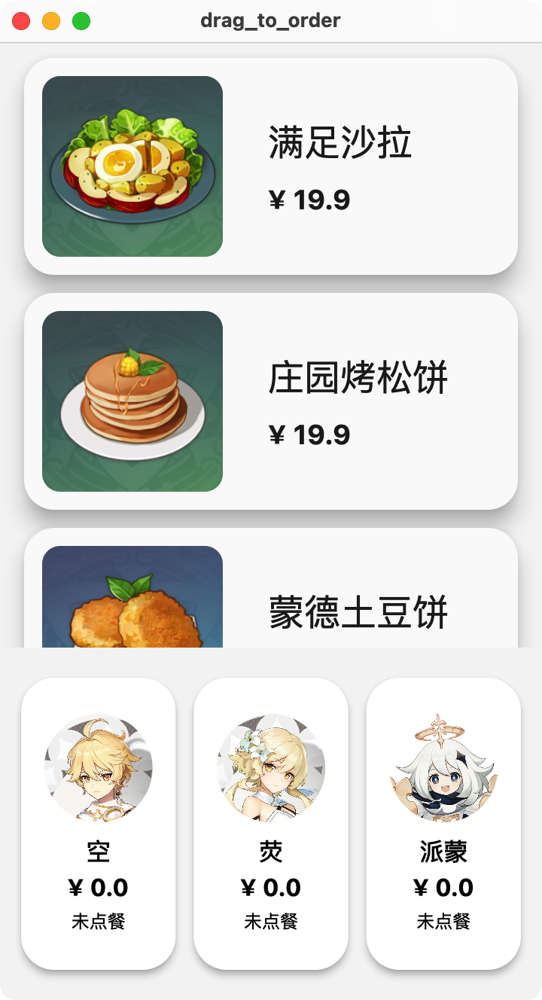
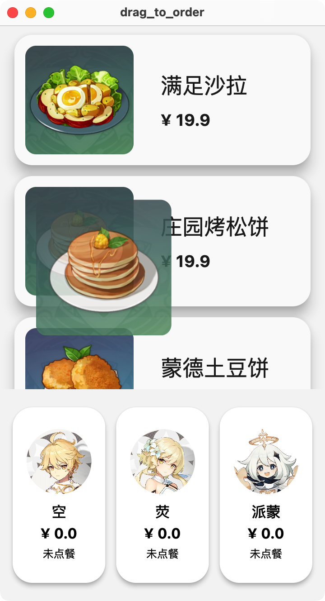

# 实际案例

这一节课我们通过三个稍微炫酷一些的案例来综合前面讲过的所有知识，包括 Flutter 中 常用 Widgets、状态管理、布局与约束、动画这些核心知识点。

## 拖拽点餐

案例代码 [GitHub | drag_to_order](https://github.com/thu-flutter-dev/drag_to_order)

> 此案例源自 [Flutter Cookbook | Effects: Drag a UI element](https://docs.flutter.dev/cookbook/effects/drag-a-widget)。
>
> 案例中使用的图片来自 [原神 BWIKI](https://wiki.biligame.com/ys/)
>
> 代码中使用 separate widgets 而不是官方代码中的 helper methods 组织用户界面代码。关于这两种代码组织结构，可以参考 [Stack Overflow | What is the difference between functions and classes to create reusable widgets?](https://stackoverflow.com/a/53234826/14298786) 和 [YouTube | Widgets vs helper methods | Decoding Flutter](https://www.youtube.com/watch?v=IOyq-eTRhvo)。

### 简介

长按拖拽（drag-and-drop）在手机的手势操作中算是非常常见的操作：比如发微信朋友圈的时候长按拖拽调整图片顺序、在文件管理器中将文件拖入文件夹...我们来通过一个拖拽点餐的完整案例来学习在 Flutter 中实现该功能的方法。

我们希望做出的拖拽点餐的效果大概是这样的：

可以看到，应用界面主要分为上方的菜单和下方的顾客栏，菜单中每个食物显示一行，包含图片、名称和价格，顾客栏则包含顾客头像、名字、价格、已点的菜品数量：

当用户长按上方的某个食物时，界面上会多出一个半透明的食物图片跟着用户手指移动：

当食物被拖拽到下方顾客处，顾客的名片会高亮，此时松手即算作对应的顾客点一份视频：

同时下方每位顾客的食物总金额也会被计算得到：

此示例的核心知识点有：

- 使用 Row、Column、SizedBox 等基础元素进行界面布局
- 长按拖拽功能

### 整体讲解

代码总共包含两个源文件：`lib/main.dart`（数据部分）和 `lib/model.dart`（界面部分）。

#### 数据部分

在 `lib/main.dart` 中，定义了类 `Item` 和 `Customer` 分别表示食物和顾客。同时定义了两个全局变量`test_items` 和 `test_customers` 放置示例（使用全局变量并不是一个好习惯，当你的数据需要与用户界面产生关联时（数据需要渲染在屏幕上时），最好使用 `StatefulWidget` 或者 `Provider` 之类的框架定义状态，确保 Flutter 在数据变化时能够正确渲染）。

#### 界面部分

应用整体是一个普通的单页应用，`MaterialApp` 套了单个 `Scaffold`。

在 `FoodStallOrderMenu` 中使用 `Column` 组织起上方的食品菜单 `ItemsView` 和下方的顾客栏 `CustomersView`。

接下来从较小的 Widget 看起：`ItemView` 和 `CustomerView` 分别代表单个食品和顾客的 Widget；将 `ItemView` 放入一个 `ListView` 即组成了 `ItemsView`，将 `CustomerView` 放入一个 `Row` 即组成了 `CustomersView`。

我们实现的拖拽功能集于上面所说的用户界面实现。Flutter 中，长按拖拽需要：

- 添加三个 Widget
    - 给被拖拽的 Widget 包裹 `LongPressDraggable`（`DraggableItemView`）
    - 拖拽提示的 Widget（`DraggingItemView`）
    - 给拖拽目标的 Widget 包裹 `DragTarget`（`DroppableCustomerView`）
- 使用范型添加拖拽传递的数据类型，如 `LongPressDraggable<Item>` 和 `DragTarget<Item>`

### 拖拽功能详解

#### DraggableItemView

`LongPressDraggable<Item>` 的参数比较简洁明了：

- `data` 拖拽过程中传输的数据。
- `dragAnchorStrategy` 拖拽使用的方法，`pointerDragAnchorStrategy` 表示 `DraggingItemView` 随着手指的移动而移动。
- `feedback` 为拖拽过程中显示的图片/图标。

#### DraggingItemView

`DraggingItemView` 用一个普通的 `ClipRRect` 来显示图片。

关于 `FractionalTranslation`：代码中使用的参数是 `translation: const Offset(-0.5, -0.5)`，同学们可以将这个值调整为 `Offset(0.0, 0.0)`，这时半透明的食物图片会在手的右下方。`FractionalTranslation` 相当于是给 `ClipRRect` 加了一个向左上角一半宽一般长的偏移。

#### DroppableCustomerView

`candidateItems` 为拖拽至区域中的数据。当用户松开手指，`onAccept` 被调用，食物被添加到顾客的 `items` 中。

## 多态下载按钮

案例代码 [GitHub | multi_state_download_button](https://github.com/thu-flutter-dev/multi_state_download_button)

> 此案例源自 [Flutter Cookbook | Create a download button](https://docs.flutter.dev/cookbook/effects/download-button)。

TODO 添加整体的简单讲解和重点知识点（动画）的讲解

## 简易照片滤镜

案例代码 [GitHub | photo_fliter](https://github.com/thu-flutter-dev/photo_fliter)

> 此案例源自 [Flutter Cookbook | Create a photo filter carousel](https://docs.flutter.dev/cookbook/effects/photo-filter-carousel)。

TODO 添加整体的简单讲解和重点知识点（约束和动画）的讲解
