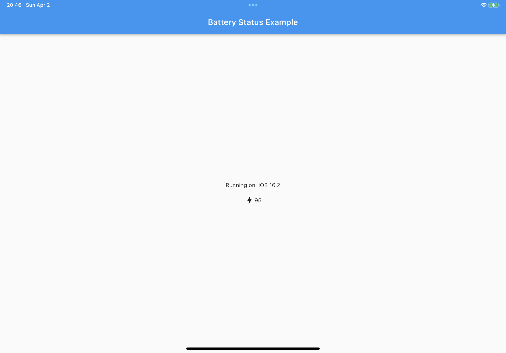

# 包

Flutter 与原生应用的交互主要有两种：

1. 原生应用为主体，其中一些组件使用 Flutter Widget 构建（原生应用中的一些代码调用 Dart 代码）
2. Flutter 应用为主体，其中的一些组件使用原生组件构建（Flutter 应用中的一些代码调用原生平台的代码）

第一种交互主要是由于 Flutter 是一款新的框架，现在市场上很多应用还是基于原生构建的，如果希望改为 Flutter，可能很难整个应用从零开始改写，可以将一些通用的组件替换为 Flutter。具体可以查看官方教程 [Flutter | Add Flutter to existing app](https://docs.flutter.dev/development/add-to-app)。

但个人感觉必要性不是那么大，对于规模非常大的互联网企业来说，如果需要使用原生开发，直接全部使用原生开发就可以了，没有必要在其中插入 Flutter 组件折腾。

第二种交互也是由于 Flutter 是一款新的框架，底层轮子还不够多。对于小规模的应用开发团队而言，以 Flutter 为主体开发更合适。不过你可能找不到一些能够直接生产使用的组件，这时嵌入原生平台的一些组件是很好的选择。官网文档 [Flutter | Platform integration](https://docs.flutter.dev/development/platform-integration) 给出了对应的指导。

我们的课程主要聚焦在「嵌入原生」，也就是「Platform integration」，后面我们简称为包、（第三方）包。

## 什么是包（package）

- 提供一些常用的函数库（如数学运算库）
- 提供一些常用的 Widget（如 Material Design 的组件）
- 让 Flutter 能够调用各种操作系统提供的 API
- 让 Flutter 调用呈现原生平台的一些组件，减少重复造轮子的情况

### 搜索

Flutter 的所有包都可以在 [pub.dev](https://pub.dev) 上找到，打开之后就可以看到一个大大的搜索按钮。

### 使用方法

在 [pub.dev](https://pub.dev) 中点击任意一个包，在 Installing 可以看到安装的方式。你可以在项目根目录用 `flutter pub add <package>` 安装某个包，也可以在 pubspec.yaml 的 `dependencies` 列表中添加项目的名称和版本，再执行 `flutter pub get` 来下载这个包。

在项目中，需要对应 `import` 包中需要的函数、类、Widget 等内容。

### 版本

在**创建包**的过程中，你需要指定包的版本，这时最好遵守 [Semantic Versioning](https://semver.org)。Semantic Versioning 由三部分组成：大版本号、小版本号和补丁版本号，用 . 连接起来。

- 当包向外暴露的 API 未改变时，增加补丁版本号
- 当包添加新的 API 时，增加小版本号
- 当包中 API 发生删减或调整时，增加 大版本号

也就是说，如果大家都遵守 Semantic Versioning，那么当大版本号发生改变时，包可能出现无法兼容的情况。

在**使用包**的过程中，我们一般希望可以用到最新的补丁和最新的功能，但是我们不希望出现无法兼容的情况，所以在 pubspec.yaml 的 `dependencies` 中添加包时，我们一般会使用下面的语法：

```yml
dependencies:
  package: ^x.y.z
```

其中 `^` 表示大于等于 `x.y.z` 且小于 `x+1.y.z` 的所有版本。Dart 的包管理工具会为我们选择合适版本的包。

## 常用包

### Flutter Favorite packages

[Flutter Favorite packages](https://pub.dev/packages?q=is%3Aflutter-favorite) 现在（2022.3.7）共有 67 个，其中包含很多常用的包，可以满足开发过程中的一些需求。同学可以查看这些包的 README 来了解包所提供的功能。

### Flutter Package of the Week

Flutter 官方在 YouTube 开设了 [Flutter Package of the Week](https://www.youtube.com/playlist?list=PLjxrf2q8roU1quF6ny8oFHJ2gBdrYN_AK) 这一合集，其中介绍了很多常用的第三方包，能够极大提高开发效率；课程中用到的很多包也都包含在其中。每一集时间不长，感兴趣的同学应该可以很快看完。

## 创建插件

> 当我们创建的包调用了目标平台的 API，我们往往将这种包称作插件（plugin）。
>
> 主要参考资料：
>
> - [Flutter | Developing packages & plugins](https://docs.flutter.dev/development/packages-and-plugins/developing-packages)
> - [Flutter | Writing custom platform-specific code](https://docs.flutter.dev/development/platform-integration/platform-channels)
> - [Flutter API | MethodCall class](https://api.flutter.dev/flutter/services/MethodCall-class.html)
> - [Flutter API | Result class](https://api.flutter.dev/flutter/flutter_driver/Result-class.html)

在创建插件这个章节，我们主要通过实践来学习：

我们希望创建一个插件，可以获取当前设备的充电情况和电池电量，支持 Android 和 iOS。

### 默认模板

用下面的命令创建一个插件模板。

```
flutter create --org io.github.thu-mobile-dev --template=plugin --platforms=android,ios -a java -i swift plugin_example
```

- `--org` 给出企业、组织、个人的反向域名，一些代码中会使用到。
- `--template=plugin` 表示我们使用插件模板。
- `--platforms` 给出插件支持的平台，这里我们暂时只关注 Android 和 iOS 平台
    - `-a` 给出 Android 平台代码的默认语言。
    - `-i` 给出 iOS 平台代码的默认语言。

创建好后，在 example/ 文件夹中，我们可以直接通过 flutter run 命令查看默认的模板创建的样例应用。该应用会显示目标平台的名称，效果如下：


查看具体的代码：

- 在 example/lib/main.dart 中，创建了一个实例 `final _pluginExamplePlugin = PluginExample();`，通过实例的 `getPlatformVersion()` 方法，获取目标平台的名称。
- `PluginExample` 这个类则是由我们刚刚创建的插件提供的，在 lib/plugin_example.dart 中。可以看到在 example/pubspec.yaml 中，有一行 `plugin_example: path: ../` 导入了插件。
- 在 lib/plugin_example_platform_interface.dart 中，`PluginExamplePlatform` 类继承 `PlatformInterface`，作为目标平台调用代码的类的基类。可以看到里面就有默认的 `getPlatformVersion()`，如果子类没有重载这个方法，就会返回错误提示。
- 在 lib/plugin_example_method_channel.dart 中，通过 `MethodChannel` 类的 `invokeMethod()` 方法来调用目标平台代码。
    - 在 android/src/main/java/io/github/thumobiledev/plugin_example/PluginExamplePlugin.java 中，`PluginExamplePlugin` 的 `onMethodCall()` 方法处理从 Flutter 发起的函数调用，通过判断 `call.method` 来确定调用什么功能。通过 `result.success()` 返回。
    - 在 ios/Classes/PluginExamplePlugin.swift 中，`PluginExamplePlugin` 类的 `handle()` 方法处理从 Flutter 发起的函数调用，同样可以通过 `call.method` 来确定调用什么功能。通过 `result()` 返回。

### 添加获取电池状态的函数

> 完整的项目地址 https://github.com/thu-mobile-dev/battery_status，

用下面的命令创建电池信息插件：

```
flutter create --org io.github.thu-mobile-dev --template=plugin --platforms=android,ios -a java -i swift battery_status
```

与上面的模板一样，我们只需要对应添加函数来获取电池电量和电池是否充电即可。

在 lib/battery_status_platform_interface.dart 的 BatteryStatusPlatform 类中，我们添加两个方法 `Future<bool?> isCharging()` 和 `Future<double?> value()`。在 lib/battery_status_method_channel.dart 的 MethodChannelBatteryStatus 类中，我们重载刚刚的两个方法，进一步调用目标平台代码。

iOS 与 Android 部分需要查看 Google 和 Apple 提供的 API 文档找到原生的 API，调用并返回。感兴趣的同学可以查看 android/src/main/java/io/github/thumobiledev/battery_status/BatteryStatusPlugin.java 和 ios/Classes/BatteryStatusPlugin.swift。

在 example/ 文件夹中执行 flutter run 将应用安装到 Android 或 iOS 真机上（虚拟机可能不支持获取电量），可以看到效果如下所示：




ps. 如果同学有兴趣，也可以进一步支持 Windows、macOS、Linux、Web 端查看设备电量。欢迎提 Pull Request！
