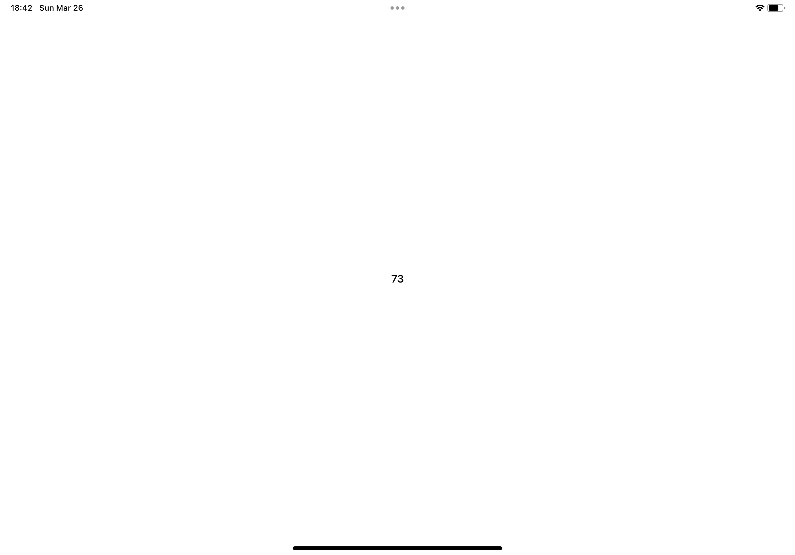
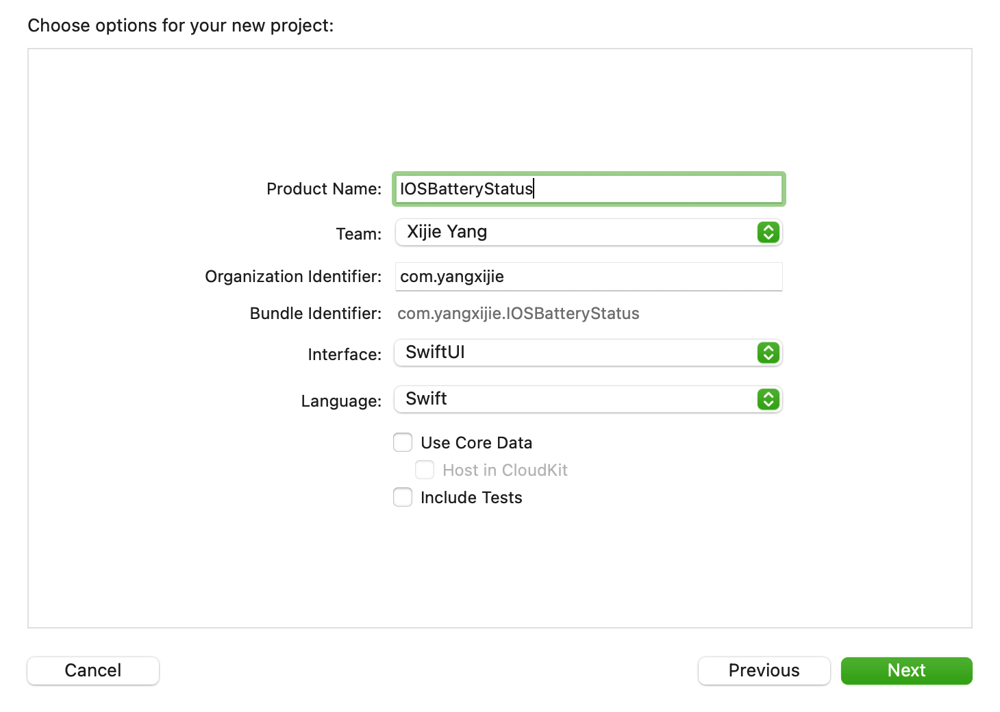

# iOS 电池状态获取

我们使用 Swift 调用 iOS 提供的电池 API 来获取电池状态和电量：

- 调用 `UIDevice.current.isBatteryMonitoringEnabled = true` 确保电池状态可获取。
- 通过 `UIDevice.current.batteryState` 拿到电池状态
- 通过 `UIDevice.current.batteryLevel` 拿到电量

进一步创建 `BatteryStatus` 类：

```swift
class BatteryStatus {
    var isCharging: Bool? {
        return ...
    }
    var value: Float? {
        return ...
    }
}
```

- `isCharging` 属性判断设备是否正在充电，`null` 表示无法获取设备电池状态
- `value` 为一个 0.0 到 1.0 的小数，表示设备的电量，`null` 表示无法获取设备电池状态

使用 SwiftUI 构建页面，完整的 ContentView.swift 呈现如下：

```swift
import SwiftUI
import UIKit

class BatteryStatus {
    var isCharging: Bool? {
        UIDevice.current.isBatteryMonitoringEnabled = true
        if UIDevice.current.batteryState == .unknown {
            return nil
        } else if UIDevice.current.batteryState == .charging || UIDevice.current.batteryState == .full {
            return true
        } else {
            return false
        }
    }

    var value: Float? {
        UIDevice.current.isBatteryMonitoringEnabled = true
        if UIDevice.current.batteryState == .unknown {
            return nil
        } else {
            return UIDevice.current.batteryLevel
        }
    }
}

struct ContentView: View {
    let batteryStatus = BatteryStatus()
    var body: some View {
        HStack {
            if batteryStatus.isCharging == nil {
                Image(systemName: "questionmark")
            } else if batteryStatus.isCharging! {
                Image(systemName: "bolt.fill")
            }
            if batteryStatus.value == nil {
                Image(systemName: "questionmark")
            } else {
                Text("\(Int(batteryStatus.value! * 100))")
                    .bold()
            }
        }
        .padding()
    }
}
```

在 iOS 真机上运行，得到下面的结果：




## 附：Xcode 创建 SwiftUI 项目



